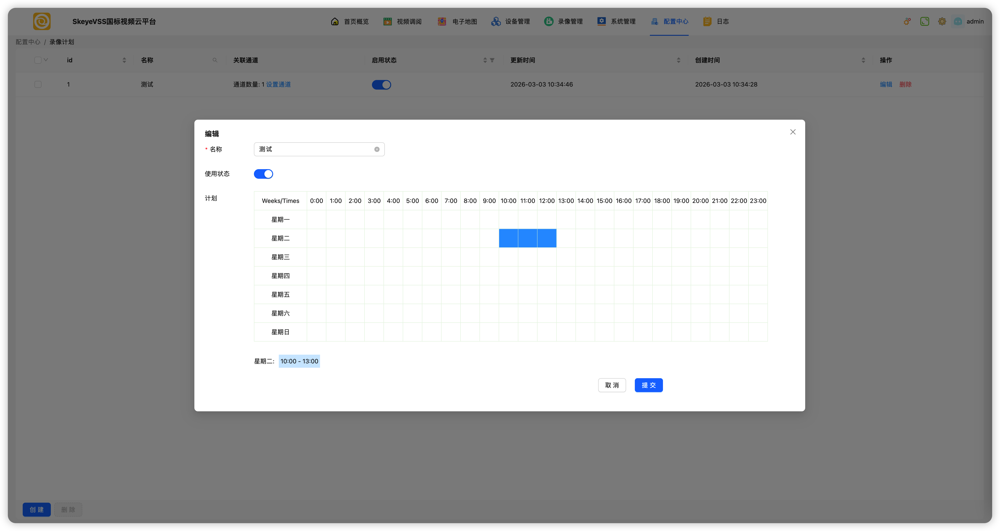
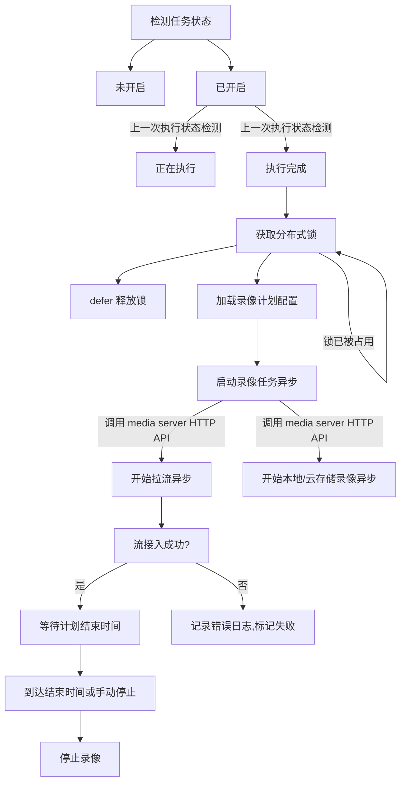

# GB28181 平台录像任务调度与设备录像查询机制详解

## 简介

在基于 **GB/T 28181** 国家标准构建的视频监控平台中，录像功能通常分为两类：
1. **计划录像（定时/事件触发）**：由平台主动发起，通过媒体服务器拉流并存储；
2. **设备端历史录像查询**：前端通过信令服务器向设备请求已存在的录像记录。

本文将完整覆盖 **从录像任务创建、分布式调度执行，到设备端历史录像分批查询** 的全流程，结合流程图、时序图与真实 SIP 信令日志，帮助开发者深入理解国标平台的录像机制设计与实现细节。

---

## 整体交互流程

以下为平台设备录像的完整时序：

### 创建录像计划

用户在前端界面配置录像策略（如每天 00:00–24:00 全天录像），平台将该计划持久化至数据库，并启动后台任务调度器。

### 计划任务执行流程

