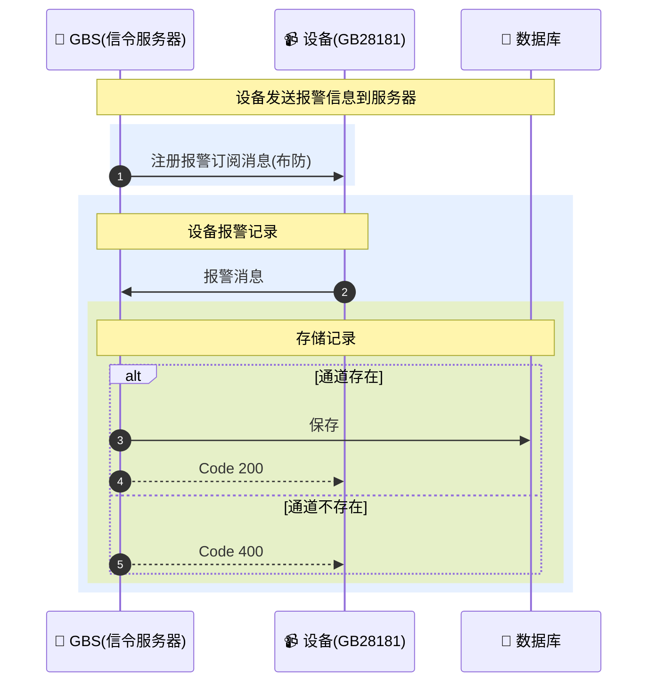

### 📨 订阅消息

```
[GBS] 2026-03-02 16:13:16 [UDP][192.168.50.87:11008]>>>>>>[192.168.50.104:5060]>>>>>>
SUBSCRIBE sip:34020000001320000104@192.168.50.104:5060 SIP/2.0
Via: SIP/2.0/UDP 192.168.50.87:11008;rport=11008;branch=z9hG4bK5111380649
From: <sip:31010000042220000002@192.168.50.87:11008>;tag=095861915
To: <sip:34020000001320000104@192.168.50.104:5060>
Call-ID: 9581233242
User-Agent: SkeyevssSevVss 192.168.50.87
CSeq: 872 MESSAGE
Max-Forwards: 70
Expires: 3900
Content-Type: Application/MANSCDP+xml
Content-Length: 259
Contact: <sip:34020000001320000104@3101000004>
Event: presence

<?xml version="1.0" encoding="GB2312"?>
<Query>
  <CmdType>Alarm</CmdType>
  <SN>871</SN>
  <DeviceID>34020000001320000104</DeviceID>
  <StartAlarmPriority>0</StartAlarmPriority>
  <EndAlarmPriority>0</EndAlarmPriority>
  <AlarmMethod>0</AlarmMethod>
</Query>
```

### 📨 报警消息

```
[GBS] 2026-03-02 00:01:42 [UDP][[::]:11008]<<<<<<[设备ip:5060]<<<<<<
MESSAGE sip:31010000042220000002@10.206.0.4:11008 SIP/2.0
Call-ID: c40e1e82cdd9a3f548b301b4cc419a4f
Content-Length: 0
Content-Type: Application/MANSCDP+xml
CSeq: 15314 MESSAGE
From: <sip:34020000001320000108@192.168.0.109:5060>;tag=a4ff486495941283b014ebaeb73780d4
Max-Forwards: 70
To: <sip:31010000042220000002@10.206.0.4:11008>
User-Agent: SIP UAS V.2016.xxxx
Via: SIP/2.0/UDP 192.168.0.109:5060;rport=5060;branch=z9hG4bKa5dda7a0013d19ee38ed7d6bacb9627c;received=设备ip

<?xml version="1.0" encoding="GB2312" standalone="yes" ?>
<Notify>
    <CmdType>Alarm</CmdType>
    <SN>15007</SN>
    <DeviceID>34020000001320000108</DeviceID>
    <AlarmPriority>1</AlarmPriority>
    <AlarmMethod>5</AlarmMethod>
    <AlarmTime>2026-03-02T00:01:42</AlarmTime>
    <AlarmDescription>描述</AlarmDescription>
    <AlarmInfo>11</AlarmInfo>
    <Info>
        <AlarmType>2</AlarmType>
        <AlarmTypeParam>
            <EventType>1</EventType>
        </AlarmTypeParam>
    </Info>
</Notify>

```

| 字段                            | 字段说明   | 取值说明                                                                                                                                                                                                                                                                                                                 |
|:------------------------------|:-------|:---------------------------------------------------------------------------------------------------------------------------------------------------------------------------------------------------------------------------------------------------------------------------------------------------------------------|
| CmdType                       | 命令类型   | Alarm-报警                                                                                                                                                                                                                                                                                                             |
| SN                            | 消息序列号  | 唯一标识请求/响应                                                                                                                                                                                                                                                                                                            |
| DeviceID                      | 设备国标ID | 20位国标编码                                                                                                                                                                                                                                                                                                              |
| AlarmPriority                 | 报警级别   | 1-一级警情<br>2-二级警情<br>3-三级警情<br>4-四级警情                                                                                                                                                                                                                                                                                 |
| AlarmMethod                   | 报警方式   | 1-电话报警<br>2-设备报警<br>3-短信报警<br>4-GPS报警<br>5-视频报警<br>6-设备故障报警<br>7-其他报警                                                                                                                                                                                                                                                |
| AlarmTime                     | 报警时间   | ISO格式: yyyy-MM-ddTHH:mm:ss                                                                                                                                                                                                                                                                                           |
| AlarmDescription              | 报警描述   | 文本描述信息                                                                                                                                                                                                                                                                                                               |
| Longitude                     | 经度     | GPS经度坐标                                                                                                                                                                                                                                                                                                              |
| Latitude                      | 纬度     | GPS纬度坐标                                                                                                                                                                                                                                                                                                              |
| AlarmInfo                     | 报警附加信息 | 自定义扩展字段                                                                                                                                                                                                                                                                                                              |
| Info/AlarmType                | 报警类型   | **AlarmMethod=2时**:<br>1-视频丢失报警<br>2-设备防拆报警<br>3-存储磁盘满报警<br>4-设备高温报警<br>5-设备低温报警<br>**AlarmMethod=5时**:<br>1-人工视频报警<br>2-运动目标检测报警<br>3-遗留物检测报警<br>4-物体移除检测报警<br>5-绊线检测报警<br>6-入侵检测报警<br>7-逆行检测报警<br>8-徘徊检测报警<br>9-流量统计报警<br>10-密度检测报警<br>11-视频异常检测报警<br>12-快速移动报警<br>**AlarmMethod=6时**:<br>1-存储设备磁盘故障<br>2-存储设备风扇故障 |
| Info/AlarmTypeParam/EventType | 事件类型   | 入侵检测报警时:<br>1-进入区域<br>2-离开区域                                                                                                                                                                                                                                                                                         |