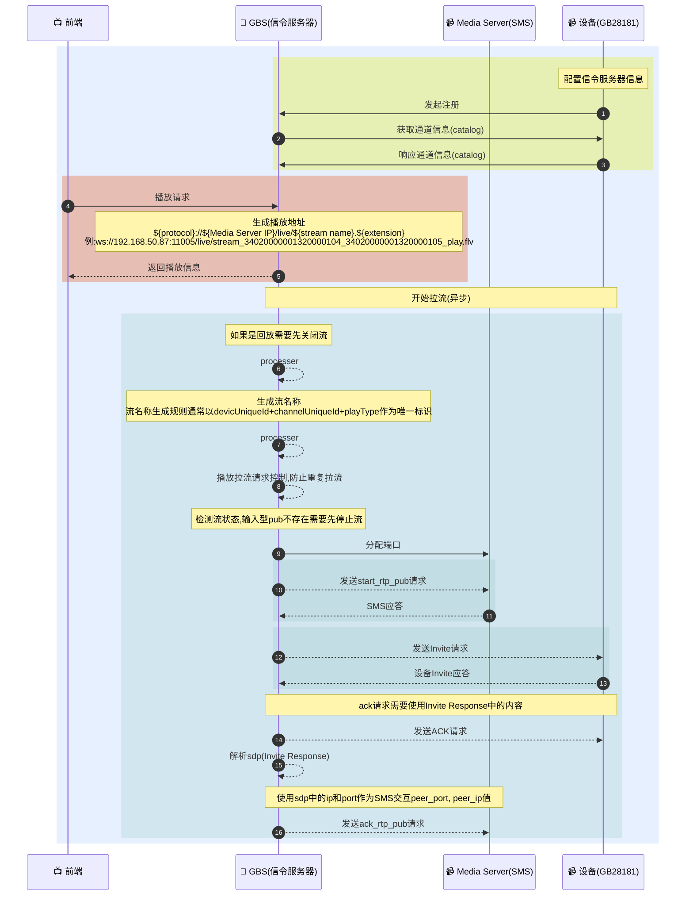

# GB28181 实时流拉取与播放全流程解析：从设备注册到 INVITE 建立媒体通道

## 简介

在 GB/T 28181 国标视频平台中，**实时视频播放**是核心功能之一。该过程涉及设备注册、信令交互、媒体服务器（Media Server）协同、SDP 协商等多个环节。尤其关键的是通过 **SIP INVITE + SDP** 建立 RTP/RTCP 媒体通道，并由媒体服务器完成流的接收、转封装与分发。

本文结合 **完整 Mermaid 时序图、真实 SIP 信令日志、Go 语言实现代码**，系统性梳理从“前端点击播放”到“用户看到画面”的全链路流程。

---

## 整体交互流程

以下为平台拉取设备实时流的完整时序：



**关键点**
1. invite
   - from: ip/port须填写信令服务器的地址信息
   - to: ip/port须填写设备的地址信息
2. Sip Request
   - 在不使用Request Cache的情况下, invite和ack中的信息需要保持一致
   - Call-ID, Via需要保持一致
   - 严格参考国标文档, 如果有一个值填写错误将不能成功播放 
   - 注意区分发送/接收Invite中sdp信息中的差异, 由设备/信令服务器发出的sdp信息中字段值
     - Origin ("o=")
       - 信令服务器请求设备 通道id, IP/Port = SMS(告诉设备往哪个地址推流)
       - 设备请求信令服务器 设备id, IP/Port = 设备地址(peer_ip,peer_port,告诉流媒体设备端推送地址)
     - Connection ("c=")
       - 信令服务器请求设备Address = SMS IP(推流的流媒体地址)
       - 设备请求信令服务器Address = 设备 IP(设备端推流地址)

### invite请求/响应

```
# 请求
[GBS] 2026-02-28 10:20:08 [UDP][192.168.50.87:11008]>>>>>>[192.168.50.104:5060]>>>>>>
INVITE sip:34020000001320000105@192.168.50.104:5060 SIP/2.0
Via: SIP/2.0/UDP 192.168.50.87:11008;rport=11008;branch=z9hG4bK2987171291
From: <sip:31010000042220000002@192.168.50.87:11008>;tag=811400952
To: <sip:34020000001320000105@192.168.50.104:5060>
Call-ID: 7994646177
User-Agent: SkeyevssSevVss 192.168.50.87
CSeq: 2 INVITE
Max-Forwards: 70
Content-Type: APPLICATION/SDP
Contact: <sip:31010000042220000002@192.168.50.87:11008>
Subject: 34020000001320000105:0200000105,31010000042220000002:0
Content-Length: 314

v=0
o=34020000001320000105 0 0 IN IP4 192.168.50.87
s=Play
u=34020000001320000105:0
c=IN IP4 192.168.50.87
t=0 0
m=video 30000 TCP/RTP/AVP 96 97 98 99
a=recvonly
a=rtpmap:96 PS/90000
a=rtpmap:97 MPEG4/90000
a=rtpmap:98 H264/90000
a=rtpmap:99 H265/90000
a=setup:passive
a=connection:new
y=0200000105

# 响应
[GBS] 2026-02-28 10:20:08 [UDP][192.168.50.87:11008]<<<<<<[192.168.50.104:5060]<<<<<<
SIP/2.0 200 OK
Via: SIP/2.0/UDP 192.168.50.87:11008;rport=11008;branch=z9hG4bK2987171291
From: <sip:31010000042220000002@192.168.50.87:11008>;tag=811400952
To: <sip:34020000001320000105@192.168.50.104:5060>;tag=1026846081
Call-ID: 7994646177
CSeq: 2 INVITE
Contact: <sip:34020000001320000104@192.168.50.104:5060>
Content-Type: application/sdp
User-Agent: IP Camera
Content-Length: 209

v=0
o=34020000001320000104 2463 2463 IN IP4 192.168.50.104
s=Play
c=IN IP4 192.168.50.104
t=0 0
m=video 15060 TCP/RTP/AVP 96
a=setup:active
a=sendonly
a=rtpmap:96 PS/90000
a=filesize:0
y=0200000105

```

### Ack

```
[GBS] 2026-02-26 10:05:37 [UDP][192.168.50.87:11008]>>>>>>[192.168.50.104:5060]>>>>>>
ACK sip:34020000001320000105@192.168.50.104:5060 SIP/2.0
Via: SIP/2.0/UDP 192.168.50.87:11008;rport=11008;branch=z9hG4bK4389919483
From: <sip:31010000042220000002@192.168.50.87:11008>;tag=193700157
To: <sip:34020000001320000105@192.168.50.104:5060>;tag=385688899
Call-ID: 9367855484
User-Agent: SkeyevssSevVss 192.168.50.87
CSeq: 4 ACK
Max-Forwards: 70
Contact: <sip:31010000042220000002@192.168.50.87:11008>
Content-Length: 0
```

### 发送Invite请求

```

func (l *GBSSender) makeHeader(Type headerType) sip.Header {
	return l.doMakeHeader(Type, nil)
}

func (l *GBSSender) makeHeaderWithBody(Type headerType, body string) sip.Header {
	return l.doMakeHeader(Type, body)
}

func (l *GBSSender) makeHeaderWith(Type headerType, body interface{}) sip.Header {
	return l.doMakeHeader(Type, body)
}

func (l *GBSSender) doMakeHeader(Type headerType, data interface{}) sip.Header {
	switch Type {
	case headerTypeVia:
		var port = uint16(l.svcCtx.Config.Sip.Port)
		return sip.ViaHeader{
			{
				ProtocolName:    "SIP",
				ProtocolVersion: "2.0",
				Transport:       l.req.TransportProtocol,
				Host:            l.setting.SipIP(),
				Port:            (*sip.Port)(&port),
				Params: sip.NewParams().
					Add("rport", sip.String{Str: strconv.Itoa(int(port))}).
					Add("branch", sip.String{Str: "z9hG4bK" + functions.RandWithString("0123456789", 10)}),
			},
		}

	case headerTypeFrom:
		var (
			port     = uint16(l.svcCtx.Config.Sip.Port)
			fromAddr = sip.Address{
				DisplayName: l.req.DeviceAddr.DisplayName,
				Uri: &sip.SipUri{
					FUser: sip.String{Str: l.svcCtx.Config.Sip.ID},
					FHost: l.setting.SipIP(),
					FPort: (*sip.Port)(&port),
				},
				Params: sip.NewParams().Add("tag", sip.String{Str: functions.RandWithString("0123456789", 9)}),
			}
		)
		return fromAddr.AsFromHeader()

	case headerTypeTo:
		return l.toAddress().AsToHeader()

	case headerTypeToWith:
		var toHeader = l.toAddress().AsToHeader()
		toHeader.Address.SetUser(sip.String{Str: data.(string)})
		return toHeader

	case headerTypeCallId:
		var callId = sip.CallID(functions.RandWithString("0123456789", 10))
		return &callId

	case headerTypeCallIdWith:
		var callId = data.(sip.CallID)
		return &callId

	case headerTypeUserAgent:
		var userAgent = sip.UserAgentHeader(MakeCascadeUserAgent(l.svcCtx.Config.Name, l.svcCtx.Config.InternalIp))
		return &userAgent

	case headerTypeMessageCSEq:
		var csEq = sip.CSeq{
			SeqNo:      l.SN(l.deviceUniqueId),
			MethodName: sip.MESSAGE,
		}
		if data != nil {
			if v, ok := data.(sip.RequestMethod); ok {
				csEq = sip.CSeq{
					SeqNo:      l.SN(l.deviceUniqueId),
					MethodName: v,
				}
			}
		}

		return &csEq

	case headerTypeMaxForwards:
		var maxForwards = sip.MaxForwards(70)
		return &maxForwards

	case headerTypeContentType:
		return &sip.GenericHeader{
			HeaderName: HeaderContentType,
			Contents:   "Application/MANSCDP+xml",
		}

	case headerTypeContentTypeSDP:
		return &sip.GenericHeader{
			HeaderName: HeaderContentType,
			Contents:   "APPLICATION/SDP",
		}

	case headerTypeContentTypeMANSRTSP:
		return &sip.GenericHeader{
			HeaderName: HeaderContentType,
			Contents:   "Application/MANSRTSP",
		}

	case headerTypeContentLength:
		return &sip.GenericHeader{
			HeaderName: HeaderContentLength,
			Contents:   strconv.Itoa(len(data.(string))),
		}

	case headerTypeExpire:
		return &sip.GenericHeader{
			HeaderName: "Expires", Contents: "3900",
		}

	case headerTypeContact:
		var contact = &sip.ContactHeader{DisplayName: l.req.DeviceAddr.DisplayName}
		if l.req.DeviceAddr.Uri != nil {
			contact.Address = l.req.DeviceAddr.Uri.Clone()
		}

		return contact

	case headerTypeContactCurrent:
		var (
			port    = uint16(l.svcCtx.Config.Sip.Port)
			contact = &sip.ContactHeader{
				Address: &sip.SipUri{
					FUser: sip.String{Str: l.svcCtx.Config.Sip.ID},
					FHost: l.setting.SipIP(),
					FPort: (*sip.Port)(&port),
				},
			}
		)

		return contact

	case headerTypeEventPresence:
		return &sip.GenericHeader{HeaderName: "Event", Contents: "presence"}

	case headerTypeEventCatalog:
		return &sip.GenericHeader{
			HeaderName: "Event", Contents: fmt.Sprintf("Catalog;id=%s", functions.RandWithString("0123456789", 9)),
		}

	case headerTypeSubject:
		if data == nil {
			return nil
		}

		v, ok := data.(string)
		if !ok {
			return nil
		}

		return &sip.GenericHeader{HeaderName: "Subject", Contents: v}

	default:
		return nil
	}
}

func (l *GBSSender) VideoLiveInvite(data *types.SipVideoLiveInviteMessage) (sip.Request, sip.Response, error) {
	var (
		headers = []sip.Header{
			l.makeHeader(headerTypeVia),
			l.makeHeader(headerTypeFrom),
			l.makeHeader(headerTypeTo),
			l.makeHeader(headerTypeCallId),
			l.makeHeader(headerTypeUserAgent),
			l.makeHeaderWith(headerTypeMessageCSEq, sip.INVITE),
			l.makeHeader(headerTypeMaxForwards),
			l.makeHeader(headerTypeContentTypeSDP),
			l.makeHeader(headerTypeContactCurrent),
		}
		ssrc       = strings.TrimSpace(data.ChannelUniqueId[3:8] + data.ChannelUniqueId[16:20])
		playFlag   = 0
		isPlayback = data.StartAt != "" && data.EndAt != "" && data.PlayType == stream.PlayTypePlayback
	)
	if data.PlayType == stream.PlayTypePlayback {
		playFlag = 1
		atomic.AddInt64(&ssrcCounter, 1)
		ssrc = strconv.FormatInt(ssrcCounter, 10)
	}

	if isPlayback {
		headers = append(headers, l.makeHeaderWithBody(headerTypeSubject, fmt.Sprintf("%s:%d%s,%s:%s", data.ChannelUniqueId, playFlag, ssrc, l.svcCtx.Config.Sip.ID, ssrc)))
	} else {
		headers = append(headers, l.makeHeaderWithBody(headerTypeSubject, fmt.Sprintf("%s:%d%s,%s:0", data.ChannelUniqueId, playFlag, ssrc, l.svcCtx.Config.Sip.ID)))
	}

	var proto = "TCP/RTP/AVP"
	if data.TransportProtocol.MediaProtocolMode == 0 {
		proto = "RTP/AVP"
	}

	var sdpInfo = &sdp.Session{
		Version: 0,
		Origin: &sdp.Origin{
			Username:       data.ChannelUniqueId,
			Address:        data.MediaServerIP,
			SessionID:      0,
			SessionVersion: 0,
		},
		Name:       functions.Capitalize(string(data.PlayType)),
		Connection: &sdp.Connection{Address: data.MediaServerIP},
		Media: []*sdp.Media{
			{
				Type:  "video",
				Port:  int(data.StreamPort),
				Proto: proto,
				Mode:  sdp.ModeRecvOnly,
				Formats: []*sdp.Format{
					{Payload: 96, Name: "PS", ClockRate: 90000},
					{Payload: 97, Name: "MPEG4", ClockRate: 90000},
					{Payload: 98, Name: "H264", ClockRate: 90000},
					{Payload: 99, Name: "H265", ClockRate: 90000},
				},
				SSRC: fmt.Sprintf("%d%s", playFlag, ssrc),
			},
		},
		URI: fmt.Sprintf("%s:0", data.ChannelUniqueId),
	}
	if data.TransportProtocol.MediaProtocolMode == 1 {
		sdpInfo.Media[0].Attributes = sdp.Attributes{
			sdp.NewAttr("setup", data.TransportProtocol.MediaTransMode),
			sdp.NewAttr("connection", "new"),
		}
	}

	if isPlayback {
		startAt, err := time.ParseInLocation("2006-01-02 15:04:05", data.StartAt, time.Local)
		if err != nil {
			return nil, nil, err
		}

		endAt, err := time.ParseInLocation("2006-01-02 15:04:05", data.EndAt, time.Local)
		if err != nil {
			return nil, nil, err
		}

		sdpInfo.Name = "Playback"
		sdpInfo.Timing = &sdp.Timing{
			Start: startAt,
			Stop:  endAt,
		}

		if data.Download {
			sdpInfo.Name = "Download"
			if len(sdpInfo.Media) > 0 && len(sdpInfo.Media[0].Attributes) > 0 {
				sdpInfo.Media[0].Attributes = append(
					sdpInfo.Media[0].Attributes,
					// sdp.NewAttr("downloadspeed", fmt.Sprintf("%d", data.Speed)),
					sdp.NewAttr("downloadspeed", "4"),
				)
			}
		}
	}

	if data.TransportProtocol.BitstreamIndex > 0 {
		if v, ok := devices.VBitstreamIndexes[data.TransportProtocol.BitstreamIndex]; ok {
			sdpInfo.Media[0].Attributes = append(
				sdpInfo.Media[0].Attributes,
				sdp.NewAttr(v.Key, v.Value),
			)
		}
	}

	var body = sdpInfo.String()
	headers = append(headers, l.makeHeaderWithBody(headerTypeContentLength, body))
	var request = l.makeRequest(sip.INVITE, headers, body)
	response, err := l.Send(request)
	if err != nil {
		return nil, nil, err
	}

	return request, response, nil
}
```