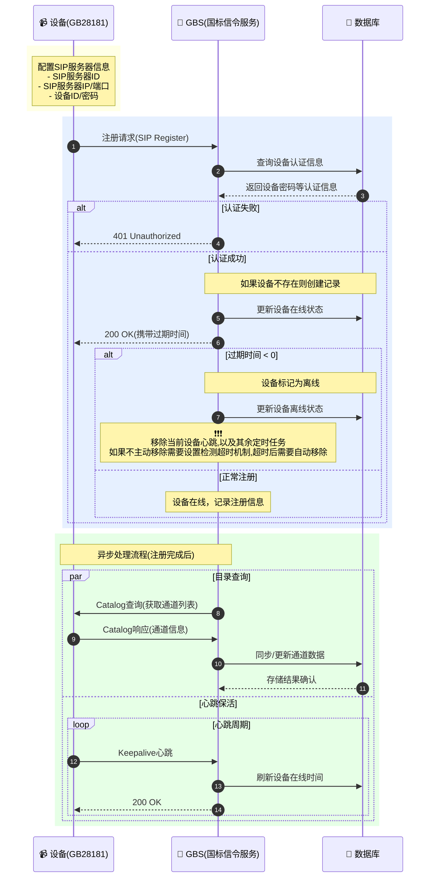

```mermaid
sequenceDiagram
    autonumber
    participant 设备 as 📹 设备(GB28181)
    participant GBS as 🎯 GBS(国标信令服务)
    participant DB as 💾 数据库
%% 设备端配置
    rect rgb(255, 255, 230)
        Note over 设备: 配置SIP服务器信息<br/>- SIP服务器ID<br/>- SIP服务器IP/端口<br/>- 设备ID/密码
    end

%% 注册请求与认证
    rect rgb(230, 240, 255)
        设备 ->> GBS: 注册请求(SIP Register)
        GBS ->> DB: 查询设备认证信息
        DB -->> GBS: 返回设备密码等认证信息

        alt 认证失败
            GBS -->> 设备: 401 Unauthorized
        else 认证成功
            Note over GBS, DB: 如果设备不存在则创建记录
            GBS ->> DB: 更新设备在线状态
            GBS -->> 设备: 200 OK(携带过期时间)

            alt 过期时间 < 0
                Note over GBS, DB: 设备标记为离线
                GBS ->> DB: 更新设备离线状态
                Note over GBS: ❗❗❗<br/>移除当前设备心跳,以及其余定时任务<br/>如果不主动移除需要设置检测超时机制,超时后需要自动移除
            else 正常注册
                Note over GBS: 设备在线，记录注册信息
            end
        end
    end

%% 目录查询流程
    rect rgb(230, 255, 230)
        Note over GBS, 设备: 异步处理流程(注册完成后)

        par 目录查询
            GBS ->> 设备: Catalog查询(获取通道列表)
            设备 ->> GBS: Catalog响应(通道信息)
            GBS ->> DB: 同步/更新通道数据
            DB -->> GBS: 存储结果确认
        and 心跳保活
            loop 心跳周期
                设备 ->> GBS: Keepalive心跳
                GBS ->> DB: 刷新设备在线时间
                GBS -->> 设备: 200 OK
            end
        end
    end
```