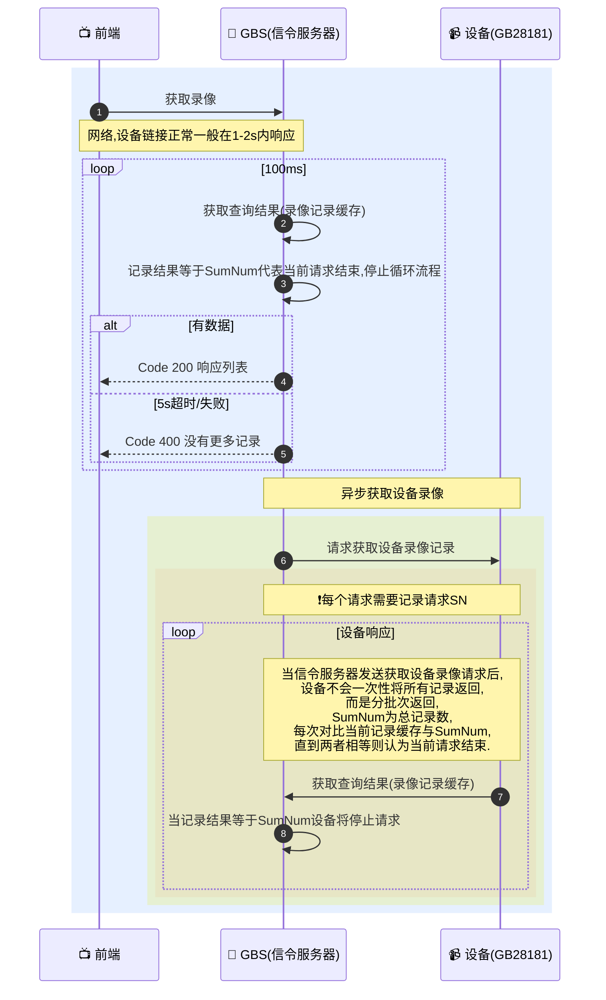

# GB28181 协议下设备录像查询机制详解：从信令交互到分批响应

## 简介

在基于 **GB/T 28181** 国家标准构建的视频监控系统中，前端平台（如 Web 应用）通常需要通过信令服务器（GBS）向联网设备（如 IPC 摄像头）查询历史录像记录。然而，由于设备性能、网络环境及协议设计限制，**录像记录并非一次性返回**，而是采用**分批次异步响应**的方式。本文结合实际 SIP 信令交互日志与 Mermaid 时序图，深入解析该过程的关键机制、超时控制逻辑及 SN（序列号）管理策略。

---

## 一、整体交互流程

以下为前端请求设备录像的完整时序：



### 📨 设备录像记录

```
[GBS] 2026-03-02 17:15:21 [UDP][192.168.50.87:11008]>>>>>>[192.168.50.104:5060]>>>>>>
MESSAGE sip:34020000001320000105@192.168.50.104:5060 SIP/2.0
Via: SIP/2.0/UDP 192.168.50.87:11008;rport=11008;branch=z9hG4bK2712176421
From: <sip:31010000042220000002@192.168.50.87:11008>;tag=020468337
To: <sip:34020000001320000105@192.168.50.104:5060>
Call-ID: 5767747845
User-Agent: SkeyevssSevVss 192.168.50.87
CSeq: 33 MESSAGE
Max-Forwards: 70
Content-Type: Application/MANSCDP+xml
Content-Length: 251

<?xml version="1.0" encoding="GB2312"?>
<Query>
  <CmdType>RecordInfo</CmdType>
  <SN>32</SN>
  <DeviceID>34020000001320000105</DeviceID>
  <StartTime>2026-03-02T00:00:00</StartTime>
  <EndTime>2026-03-02T23:59:59</EndTime>
  <Type>all</Type>
</Query>
```

### 📨 设备请求SIP录像记录

```
[GBS] 2026-03-02 17:15:22 [UDP][[::]:11008]<<<<<<[192.168.50.104:5060]<<<<<<
MESSAGE sip:31010000042220000002@3101000004 SIP/2.0
Via: SIP/2.0/UDP 192.168.50.104:5060;rport=5060;branch=z9hG4bK649193898
From: <sip:34020000001320000104@3101000004>;tag=1724001754
To: <sip:31010000042220000002@3101000004>
Call-ID: 1344951889
CSeq: 20 MESSAGE
Content-Type: Application/MANSCDP+xml
Max-Forwards: 70
User-Agent: IP Camera
Content-Length: 808

<?xml version="1.0" encoding="GB2312"?>
<Response>
    <CmdType>RecordInfo</CmdType>
    <SN>32</SN>
    <DeviceID>34020000001320000105</DeviceID>
    <Name>Camera 01</Name>
    <SumNum>19</SumNum>
    <RecordList Num="2">
        <Item>
            <DeviceID>34020000001320000105</DeviceID>
            <Name>Camera 01</Name>
            <FilePath>file_path</FilePath>
            <Address>Address 1</Address>
            <StartTime>2026-03-01T23:59:59</StartTime>
            <EndTime>2026-03-02T00:09:11</EndTime>
            <Secrecy>0</Secrecy>
            <Type>time</Type>
            <FileSize>66766336</FileSize>
        </Item>
        <Item>
            <DeviceID>34020000001320000105</DeviceID>
            <Name>Camera 01</Name>
            <FilePath>file_path</FilePath>
            <Address>Address 1</Address>
            <StartTime>2026-03-02T00:09:11</StartTime>
            <EndTime>2026-03-02T00:45:39</EndTime>
            <Secrecy>0</Secrecy>
            <Type>time</Type>
            <FileSize>264585728</FileSize>
        </Item>
    </RecordList>
</Response>
```

### 设备请求信令服务器

```go
package gbs_sip

import (
	"context"

	gosip "github.com/ghettovoice/gosip/sip"

	"skeyevss/core/app/sev/vss/internal/pkg/sip"
	"skeyevss/core/app/sev/vss/internal/types"
	"skeyevss/core/pkg/functions"
	"skeyevss/core/repositories/models/cascade"
)

var _ types.SipReceiveHandleLogic[*VideoRecordsLogic] = (*VideoRecordsLogic)(nil)

type VideoRecordsLogic struct {
	ctx    context.Context
	svcCtx *types.ServiceContext
	req    *types.Request
	tx     gosip.ServerTransaction
}

func (l *VideoRecordsLogic) New(ctx context.Context, svcCtx *types.ServiceContext, req *types.Request, tx gosip.ServerTransaction) *VideoRecordsLogic {
	return &VideoRecordsLogic{
		svcCtx: svcCtx,
		ctx:    ctx,
		req:    req,
		tx:     tx,
	}
}

func (l *VideoRecordsLogic) DO() *types.Response {
	res, err := sip.NewParser[types.SipMessageVideoRecordsResp]().ToData(l.req.Original)
	if err != nil {
		return &types.Response{Error: types.NewErr(err.Error())}
	}

	// GBC 转发
	if v, ok := l.svcCtx.GBCRecordInfoSendMaps.Get(res.DeviceID); ok {
		defer l.svcCtx.GBCRecordInfoSendMaps.Remove(res.DeviceID)

		if v.Channel.CascadeChannelUniqueId == "" {
			return nil
		}

		var cascadeRecords []*cascade.Item
		for _, item := range l.svcCtx.CascadeRecords {
			if item.Online <= 0 || item.State <= 0 {
				continue
			}

		innerLoop:
			for _, val := range item.Relations {
				if val.Parental {
					continue
				}

				if val.UniqueId == v.Channel.CascadeChannelUniqueId {
					cascadeRecords = append(cascadeRecords, item)
					break innerLoop
				}
			}
		}

		for _, item := range cascadeRecords {
			// 向上级发送消息
			if _, err := sip.NewGBCSender(l.svcCtx).WithCascade(item).RecordInfo(res, v); err != nil {
				functions.LogError("设备录像向上级发送消息失败 err:", err.Error())
			}
		}

		return nil
	}

	var records []*types.SipVideoRecordItem
	for _, item := range res.RecordList {
		var channelId = item.DeviceID
		item.DeviceID = l.req.ID
		records = append(records, &types.SipVideoRecordItem{
			SipMessageVideoRecordItem: item,
			ChannelID:                 channelId,
		})
	}

	var record = &types.SipMessageVideoRecords{
		Total: res.SumNum,
	}

	data, ok := l.svcCtx.SipMessageVideoRecordMap.Get(sip.VideoRecordMapKey(l.req.ID, res.DeviceID, res.SN))
	if ok {
		record.List = data.List
	}

	record.List = append(record.List, records...)
	l.svcCtx.SipMessageVideoRecordMap.Set(sip.VideoRecordMapKey(l.req.ID, res.DeviceID, res.SN), record)
	return nil
}

```

### GBS获取设备录像

```go
// @Title        设备录像
// @Description  main
// @Create       yiyiyi 2025/7/23 08:55

package base

import (
	"context"
	"strings"
	"sync/atomic"
	"time"

	"github.com/gin-gonic/gin"

	"skeyevss/core/app/sev/vss/internal/pkg/sip"
	"skeyevss/core/app/sev/vss/internal/types"
	"skeyevss/core/constants"
	"skeyevss/core/localization"
	"skeyevss/core/pkg/functions"
	"skeyevss/core/pkg/response"
)

var (
	_ types.HttpRHandleLogic[*VideosLogic, types.QueryVideoRecordsReq] = (*VideosLogic)(nil)

	deviceVideoSN int64 = 0
	VVideosLogic        = new(VideosLogic)
)

type VideosLogic struct {
	ctx    context.Context
	c      *gin.Context
	svcCtx *types.ServiceContext
}

func (l *VideosLogic) New(ctx context.Context, c *gin.Context, svcCtx *types.ServiceContext) *VideosLogic {
	return &VideosLogic{
		ctx:    ctx,
		c:      c,
		svcCtx: svcCtx,
	}
}

func (l *VideosLogic) Path() string {
	return "/device-videos"
}

func (l *VideosLogic) DO(req types.QueryVideoRecordsReq) *types.HttpResponse {
	if _, ok := l.svcCtx.SipCatalogLoopMap.Get(req.DeviceUniqueId); !ok {
		return &types.HttpResponse{
			Err: response.MakeError(response.NewHttpRespMessage().Err(constants.DeviceUnregistered), localization.M00300),
		}
	}

	atomic.AddInt64(&deviceVideoSN, 1)
	req.SN = deviceVideoSN
	// 向设备发送获取视频记录请求
	l.svcCtx.SipSendQueryVideoRecords <- &req

	ticker := time.NewTicker(100 * time.Millisecond)
	defer ticker.Stop()

	var (
		timeout  = time.After(5 * time.Second)
		cacheKey = sip.VideoRecordMapKey(req.DeviceUniqueId, req.ChannelUniqueId, req.SN)
	)
	for {
		select {
		case <-ticker.C:
			data, ok := l.svcCtx.SipMessageVideoRecordMap.Get(cacheKey)
			if !ok || len(data.List) < data.Total {
				continue
			}

			var times [][2]string
			for _, item := range data.List {
				item.StartTime = strings.ReplaceAll(item.StartTime, "T", " ")
				item.EndTime = strings.ReplaceAll(item.EndTime, "T", " ")
				times = append(times, [2]string{item.StartTime, item.EndTime})
			}

			var list = functions.PickWithPageOffset(int(req.Page), int(req.Limit), data.List)
			for _, item := range list {
				item.UniqueId = strings.ReplaceAll(
					strings.ReplaceAll(
						strings.ReplaceAll(
							item.StartTime+item.EndTime, "-", "",
						), " ", "",
					), ":", "",
				)

			}

			l.svcCtx.SipMessageVideoRecordMap.Remove(cacheKey)
			return &types.HttpResponse{Data: map[string]interface{}{"list": list, "count": data.Total, "slices": times}}

		case <-timeout:
			return &types.HttpResponse{
				Err: response.MakeError(response.NewHttpRespMessage().Str("设备视频获取超时"), localization.M0010),
			}
		}
	}
}


```