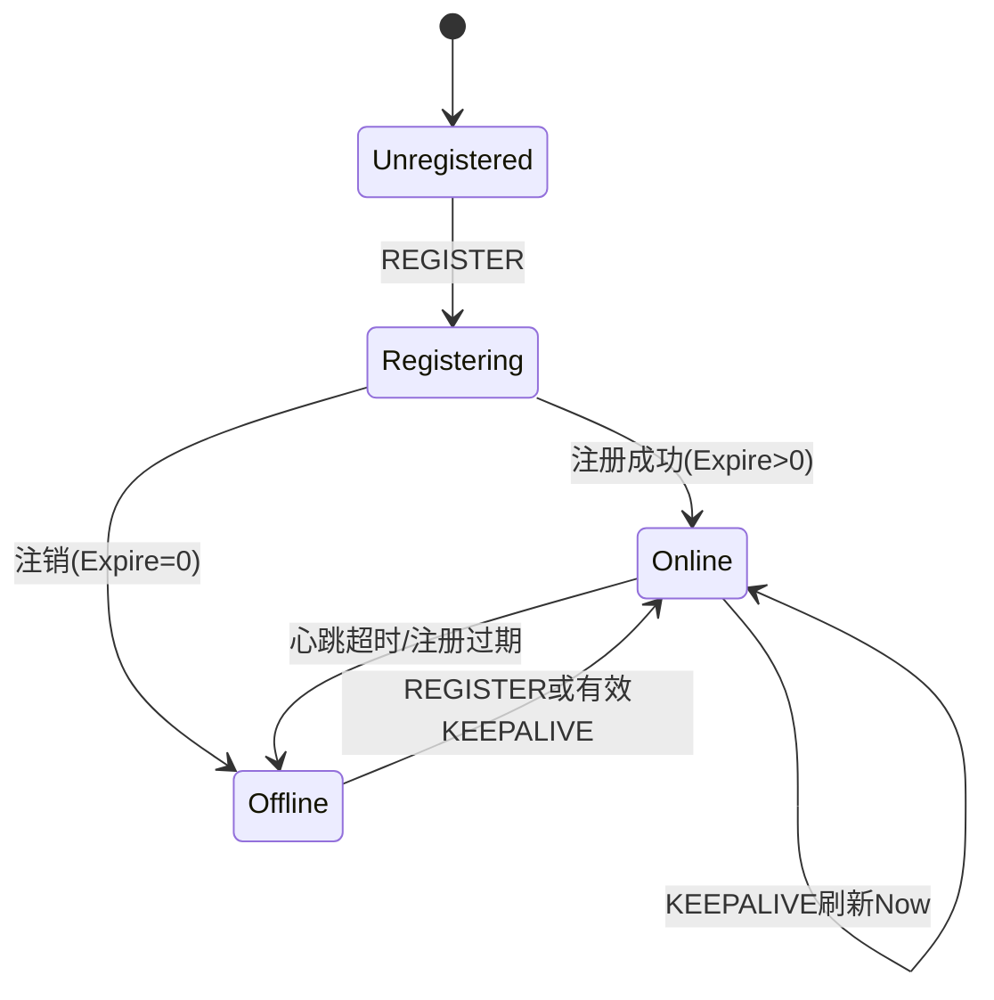
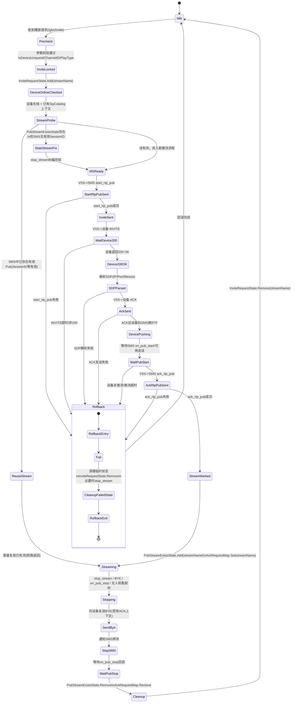
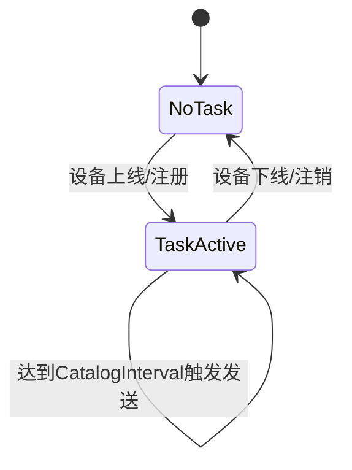
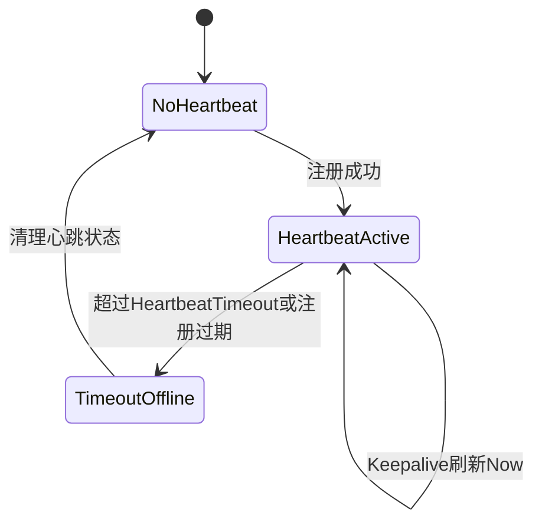

# Skeyevss 技术分享：VSS 状态机设计

[试用安装包下载](https://www.openskeye.cn/releases) | [SMS](https://github.com/openskeye/go-vss/releases/tag/V1.0.6) | [在线演示](https://showcase.openskeye.cn/)

**项目地址**：[https://github.com/openskeye/go-vss](https://github.com/openskeye/go-vss)

---

## 1. 为什么 VSS 要做状态机

VSS 同时处理：

- SIP 注册/心跳
- Catalog 定时任务
- 实时播放 Invite/Ack
- 媒体回调（`on_pub_stop` 等）
- WebSocket/SSE 实时状态同步

如果没有状态机约束，很容易出现：

- 重复 Invite（并发击穿）
- 流状态脏数据（实际停流但系统仍认为存在）
- 设备上下线抖动误判

因此 VSS 的核心设计是：**事件驱动 + 状态缓存 + 定时校验**。

---

## 2. 状态机实现骨架

VSS 不是单一大状态枚举，而是由多套状态集合组合构成。

## 2.1 关键状态容器（`ServiceContext`）

- `SipCatalogLoopMap`：设备 catalog 定时任务状态
- `SipHeartbeatLoopMap`：设备心跳检测状态
- `InviteRequestState`：按 `streamName` 的 invite 并发保护
- `PubStreamExistsState`：流是否已成功建立
- `AckRequestMap`：保存可用于 BYE 的请求上下文
- `SetDeviceOnline` + `DeviceOnlineStateUpdateMap`：设备在线状态异步更新队列

## 2.2 关键事件通道

- `SipSendCatalog`、`SipSendVideoLiveInvite`、`SipSendBye`
- `SipCatalogLoop`、`SipHeartbeatLoop`
- `SipLog`

这套设计把“状态存储”和“状态驱动事件”分离，避免业务线程直接互锁。

---

## 3. 设备生命周期状态机

## 3.1 状态图

## 3.2 关键转移规则（对应的实现）

1. **REGISTER 到来**
   - 验证 ID/鉴权
   - 写库更新设备状态
   - `Expire=0` => 离线，清理 catalog/heartbeat 任务
   - `Expire>0` => 在线，创建 catalog + heartbeat 任务

2. **KEEPALIVE 到来**
   - 更新 `SipHeartbeatLoopMap.Now`
   - 若服务重启导致 catalog 任务缺失，自动补建 catalog 任务
   - 投递 `SetDeviceOnline` 保持在线状态

3. **定时离线检测（`heartbeat_offline_loop`）**
   - 条件：`now - RegisterExpireAt > 10` 或 `now - Now >= HeartbeatTimeout`
   - 动作：移除 `SipHeartbeatLoopMap` 记录并置设备离线

---

## 4. 流生命周期状态机（播放核心）

## 4.1 状态图

## 4.2 并发保护与幂等策略

1. **InviteRequestState（防并发击穿）**
   - 进入 invite 流程前先 `Add(streamName)`
   - 流程结束 `defer Remove(streamName)`
   - 已存在则直接拒绝重复 invite

2. **PubStreamExistsState（流存在状态）**
   - Invite + Ack + `ack_rtp_pub` 成功后 `Add(streamName)`
   - 媒体回调 `on_pub_stop` 时 `Remove(streamName)`

3. **AckRequestMap（回收资源）**
   - 保存 ACK 请求上下文
   - BYE/stop_stream 时用于回收会话

## 4.3 “流占用修正”机制

若 `PubStreamExistsState` 认为流存在，但媒体侧查不到有效 `SessionID`，系统会触发本地 `stream/stop` 进行纠偏，避免僵尸状态长期占用流名。

---

## 5. Catalog 与心跳两个辅助状态机

## 5.1 Catalog 任务状态机

对应容器：`SipCatalogLoopMap`  
对应动作：定时向设备发送 catalog 查询。

## 5.2 心跳状态机

对应容器：`SipHeartbeatLoopMap`

---

## 6. 事件源与状态更新

| 事件源   | 典型事件                  | 更新状态                    | 关键动作        |
|-------|-----------------------|-------------------------|-------------|
| SIP   | REGISTER              | 在线/离线、catalog/heartbeat | 建立或删除任务     |
| SIP   | KEEPALIVE             | 心跳时间戳、在线状态              | 刷新超时计时      |
| HTTP  | `/gbs/invite`         | invite请求中、流存在状态         | 触发播放链路      |
| HTTP  | `/notify/on-pub-stop` | 流存在状态                   | 删除流状态       |
| 定时器   | heartbeat loop        | 在线状态                    | 超时置离线       |
| 定时器   | catalog loop          | catalog任务状态             | 周期发送catalog |

---

## 7. 可观测性设计

VSS 状态机调试依赖三类可观测信号：

1. **SIP 报文日志**
   - 实时（SSE）+ 文件日志
   - 关键链路：REGISTER / INVITE / ACK / BYE

2. **状态容器监控**
   - `SipCatalogLoopMap` 数量
   - `SipHeartbeatLoopMap` 数量
   - `PubStreamExistsState` 数量

3. **媒体回调事件**
   - `on_pub_start` / `on_pub_stop` / `on_sub_start`

---

## 8. 设计收益

- 状态拆分明确，避免单点大锁
- 事件通道削峰，便于并发处理
- 通过媒体回调对流状态进行闭环修正

---

## 9. 总结

VSS 的状态机并不是一个对象、一个状态字段而是：

- 以 **设备状态机** 管在线生命周期
- 以 **流状态机** 管播放会话生命周期
- 以 **定时任务状态机** 管 catalog/heartbeat 保活
- 以 **媒体回调** 做最终一致性修正

这套组合式状态机设计，是 VSS 在复杂信令场景下保持稳定运行的关键。
