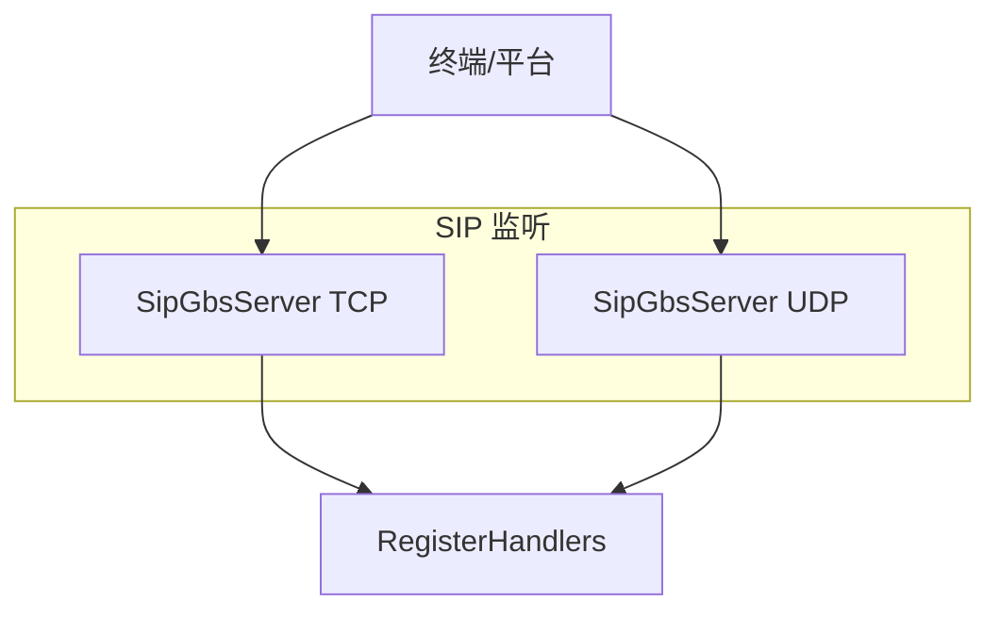
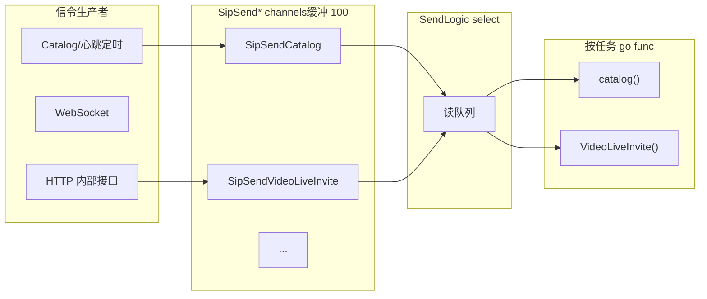
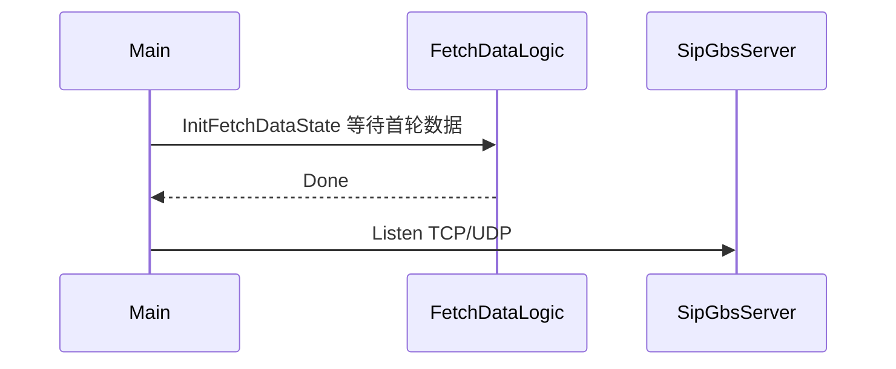

# VSS 多协议监听与 SIP 发送流水线异步化

[试用安装包下载](https://www.openskeye.cn/releases) | [SMS](https://github.com/openskeye/go-vss/releases/tag/V1.0.6) | [在线演示](https://showcase.openskeye.cn/)

**项目地址**：[https://github.com/openskeye/go-vss](https://github.com/openskeye/go-vss)

## 背景

VSS 同时承担 **GB28181 信令面**（SIP）与 **媒体面回调**（HTTP通知、WebSocket、SSE）。若信令处理与业务发送在同一线程或同步阻塞，单路设备抖动会拖慢整进程吞吐。本仓库采用 **多监听 + 有界队列 + 分发协程** 将「收包」与「发信令」解耦。

## 项目中的做法

### 1. GBS 双栈监听（TCP / UDP 并行）

`main.go` 中用 `sync.WaitGroup` 启两个 goroutine，分别对 GBS 注册同一套 Handler，绑定 **TCP** 与 **UDP**。国标设备侧常混用两种传输，**并行监听**避免在单协议上排队，同时充分利用多核。

### 2. 发送侧：单协程 `select` 多路 channel，任务再 `go` 出去

`SendLogic`（`send_sip_proc.go`）主循环从多个 `SipSend*` channel 收消息；每类消息 **再起独立 goroutine** 执行实际 `catalog` / `invite` / `bye` 等。这样：

- **分发协程**不会被慢设备或网络 RTT 阻塞，能继续消费队列；
- 不同信令类型之间 **互不抢锁**（除共享 `svcCtx` 内状态外）。

### 3. 启动屏障：`InitFetchDataState`

SIP Server 在 `Listen` 前执行 `svcCtx.InitFetchDataState.Wait()`（见 `sip.go`），保证 **字典、设置、流媒体列表** 等已从 DB RPC 拉取完毕再对外收包。避免「注册」时大量 `REGISTER` 命中未就绪配置，造成重试与无效 RPC。

## 要点

1. **不要把 SIP 回调里重逻辑直接阻塞**：应投递到 channel 或由短函数快速返回。  
2. **缓冲深度100** 是折中：过小易反压 HTTP；过大掩盖积压，需配合监控。  
3. **per-message goroutine** 在极高并发下会增加调度开销；若未来单机信令 QPS 再上一个量级，可改为 **固定 worker 池** + 按 `deviceId` 分片串行（当前以简单与隔离为主）。

## 相关代码路径

- `core/app/sev/vss/main.go` — 监听、`NewSipProc().DO(...)`  
- `core/app/sev/vss/internal/server/sip.go` — `InitFetchDataState.Wait()`  
- `core/app/sev/vss/internal/logic/gbs_proc/send_sip_proc.go` — 多路 `select` + `go` 发送
