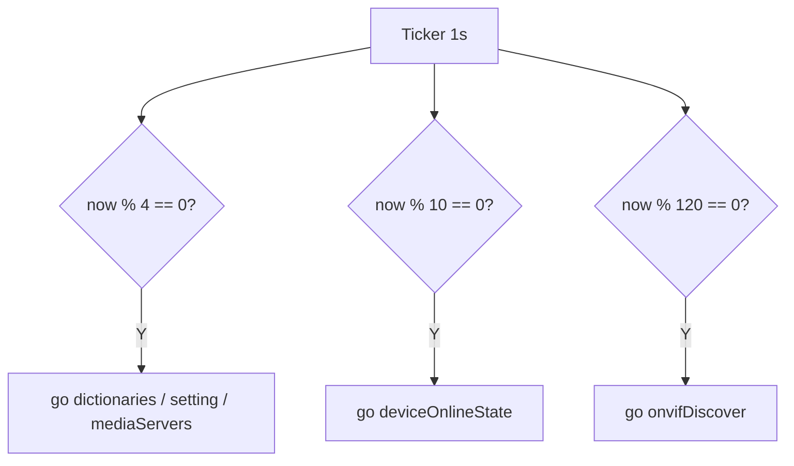
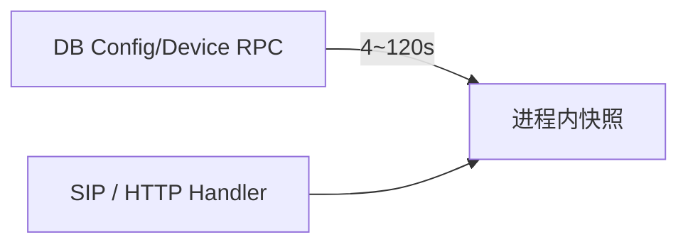

# 配置与设备快照的分频拉取

[试用安装包下载](https://www.openskeye.cn/releases) | [SMS](https://github.com/openskeye/go-vss/releases/tag/V1.0.6) | [在线演示](https://showcase.openskeye.cn/)

**项目地址**：[https://github.com/openskeye/go-vss](https://github.com/openskeye/go-vss)

## 背景

VSS 运行期需要 **字典、系统设置、流媒体节点、设备/通道在线快照、ONVIF 探测结果**。若每秒全量拉取所有数据，DB RPC 与网络开销会随实例数线性恶化。本仓库用 **单 Ticker + 时间取模** 把不同数据的刷新频率拆开，并把结果缓存在进程内。

## 项目中的做法

### 1. 首轮并行拉取，再进入周期循环

`FetchDataLogic.DO` 中：

- 使用 `sync.WaitGroup` **并行**执行 `dictionaries()` 与「`setting` → `mediaServers` → `onvifDiscover` → `deviceOnlineState`」链（后者依赖设置）。  
- 两条路径各用 `sync.Once` 触发一次 `InitFetchDataState.Done()`，与 SIP 启动屏障配合。

### 2. 分频策略（1 秒 tick）

进入 `for range time.NewTicker(time.Second).C` 后：

| 条件）            | 行为                |
|------------------|-------------------|
| `now % 4 == 0`   | 异步 `go`：字典、设置、流媒体 |
| `now % 10 == 0`  | 异步：设备/通道在线状态      |
| `now % 120 == 0` | 异步：ONVIF 探测       |

即：**秒级心跳**驱动，但 **配置类约 4s**、**在线状态 10s**、**ONVIF 120s**，根据不同场景设置获取周期。

### 3. 内存快照读路径

拉取结果写入 `svcCtx.DictionaryMap`、`svcCtx.Setting`、`MediaServerRecords`、设备在线缓存等。信令与 HTTP 逻辑 **只读内存**，把热路径与 DB 解耦。

## 要点

1. **变更延迟**：配置改完后，最坏约 **一个刷新周期** 才在 VSS 侧生效；若需秒级生效，应叠加「写后通知 / 主动 pull」机制（可参考 Backend 的 channel 刷新模式）。  
2. **突发 `go`**：每个刻度起多个 goroutine，在 CPU 紧张时可能造成短暂抖动；若 profiling 显示调度热点，可改为 **带超时的工作池** 或合并 RPC。  
3. **ONVIF 与在线状态**：探测与列表查询相对重，**长周期**是正确方向；上线初期可调大间隔减轻局域网广播压力。

## 相关代码路径

- `core/app/sev/vss/internal/logic/proc/fetch_data_proc.go`
