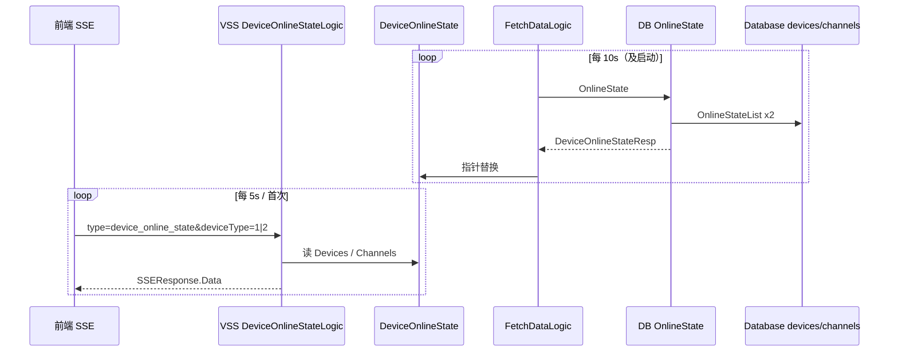
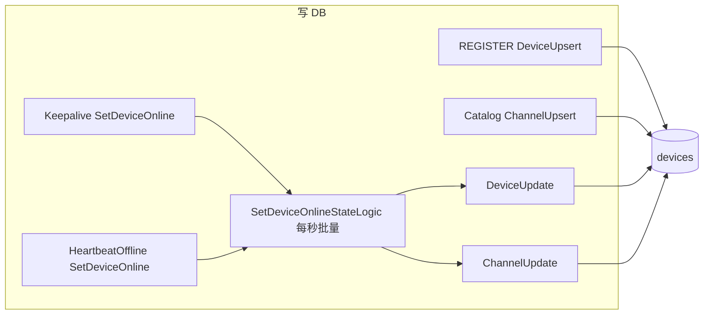

# 设备与通道在线状态

本文将结合项目代码详细讲解设备 / 通道状态如何获取与设置。

**项目地址** [https://github.com/openskeye/go-vss](https://github.com/openskeye/go-vss)

---

## 1. 角色划分

| 层级                                         | 含义         | 特点                                                                                            |
|--------------------------------------------|------------|-----------------------------------------------------------------------------------------------|
| **DB（`devices.online`、`channels.online`）** | 业务与列表的数据来源 | 由 RPC（`DeviceUpsert` / `DeviceUpdate` / `ChannelUpdate` / `ChannelUpsert`）写入                  |
| **`ServiceContext.DeviceOnlineState`**     | 所有设备在线状态集合 | 由 **`FetchDataLogic.deviceOnlineState`** 周期性拉 RPC **`OnlineState`** 填充；**SSE 读取这一份，不需要直连 DB** |

前端通过 **SSE `type=device_online_state`** 拿到的，是 **数据**；与 DB 之间最多存在 **拉取周期**（默认约 10s）的延迟。

---

## 2. SSE：如何「获取」设备 / 通道在线状态

### 2.1 入口与参数

- 路由注册：`internal/handler/sse/routers.go`，`type` 为 **`device_online_state`** 时构造 `DeviceOnlineStateLogic`。
- 请求体：`SSEDeviceOnlineStatesReq`
  - **`deviceType`**：`1` → 设备；`2` → 通道。
- 逻辑文件：`internal/logic/sse/device_online_state.go`。

### 2.2 获取

1. **`DO`**：先 `do(req)` 推送**一轮**数据；随后循环：`ctx` 取消则退出，否则 **`time.After(5*time.Second)`** 再调 **`do`**（即 **首次立即推送，之后约每 5 秒推送一次**）。
2. **`do`**：
   - 若 **`svcCtx.DeviceOnlineState == nil`**：向客户端回 **`Err`**（`deviceInlineState 为空`），并带 **`DelayClose`**，结束。
   - **`deviceType == 1`**：推送 **`DeviceOnlineState.Devices`**。
   - 否则：推送 **`DeviceOnlineState.Channels`**。

数据结构来自公共类型 **`core/common/types.DeviceOnlineStateResp`**：

```go
type DeviceOnlineStateResp struct {
    Channels map[string]uint `json:"channels"`
    Devices  map[string]uint `json:"devices"`
}
```

- **`Devices`**：`deviceUniqueId → online`（`0` 离线，`1` 在线）。
- **`Channels`**：**复合键** → `online`，键格式在 DB 服务组装为 **`{deviceUniqueId}-{channelUniqueId}`**。

因此：**SSE 不做计算**，只把 **内存里已由拉取任务灌好的两个 map** 按需（设备 / 通道）推给订阅端。

---

## 3. 数据来源：`FetchDataLogic` + RPC `OnlineState`

### 3.1 何时刷新 `DeviceOnlineState`

文件：`internal/logic/proc/fetch_data_proc.go`，方法 **`deviceOnlineState`**。

- **启动**：与设置、媒体服务、ONVIF 发现等并行；在初始化路径里会执行 **第一次** `deviceOnlineState()`。
- **周期**：主循环里 **`now%10==0`** 时 **每 10 秒** `go l.deviceOnlineState()`。

成功后将 **`l.svcCtx.DeviceOnlineState = res.Data`**。

### 3.2 DB RPC

DB 服务：`core/app/sev/db/internal/logic/deviceservice/online_state_logic.go`，**`OnlineState`**。

1. **`DevicesModel.OnlineStateList`**：查设备表，仅 **`id`、`deviceUniqueId`、`online`**，建成 **`deviceUniqueId → online`**。
2. **`ChannelsModel.OnlineStateList`**：查通道表，字段含 **`uniqueId`、`deviceUniqueId`、`online`**，建成 **`fmt.Sprintf("%s-%s", deviceUniqueId, uniqueId) → online`**。

> 这里需要注意的是：在同一网络下设备id（deviceUniqueId）能保证唯一，但通道（channelUniqueId）无法保证唯一。所以这里将设备和通道id拼接组成唯一id

---

## 4. 设置状态

在线状态最终落在 **`devices.online`**、**`channels.online`**（及 `onlineAt`、`keepaliveAt` 等辅助字段）。按来源可分几类。

### 4.1 国标 GB28181：注册直接写设备；心跳走聚合队列

| 场景                | 路径                                   | 说明                                                                                                                                                                       |
|-------------------|--------------------------------------|--------------------------------------------------------------------------------------------------------------------------------------------------------------------------|
| **REGISTER**      | `gbs_sip/register.go`                | **`DeviceUpsert`** 写入设备记录（含 **`online`**、`expire` 等）；**不经过** `SetDeviceOnline`。下线时另发 `SipCatalogLoop` / `SipHeartbeatLoop` 清理定时任务。                                       |
| **心跳 Message**    | `gbs_sip/keepalive.go`               | **`SetDeviceOnline <- DCOnlineReq{DeviceUniqueId, Online:true}`**（无通道字段），由下游批量刷新 **`DeviceUpdate`**（更新 **`keepaliveAt`**、**`onlineAt`** 等，见 `setDeviceOnlineState_loop`）。 |
| **注册超时 / 心跳超时**   | `gbs_proc/heartbeat_offline_loop.go` | 当 **`now - RegisterExpireAt > 10`** 或 **心跳间隔 ≥ `Sip.HeartbeatTimeout`** 时 **`SetDeviceOnline` 离线**；同设备从 **`SipHeartbeatLoopMap` 移除。                                      |
| **目录 Catalog 应答** | `gbs_sip/catalog.go`                 | 解析 `Status==ON` → 通道 **`online=1`**，否则 `0`；先按条件把长时间未更新的通道批量置离线，再 **`ChannelUpsert`** 同步目录；并可能 **`DeviceUpdate`** 更新通道数量。                                                |

国标 **设备级**在线：主要来自 **注册 upsert** 与 **心跳驱动的 `setDevice`（经队列）**；**通道级**在线：主要来自 **Catalog** 里的目录项状态。

### 4.2 `SetDeviceOnline` 聚合：`SetDeviceOnlineStateLogic`

文件：`internal/logic/gbs_proc/set_device_online_state_loop.go`。

1. **`SetDeviceOnline` channel** 收到 **`DCOnlineReq`**（`DeviceUniqueId`、`ChannelUniqueId`、`CId`、`Online`）。
2. **`DeviceOnlineStateUpdateMap.Set(v.DeviceUniqueId, v)`** —— 以 **设备 ID 为唯一键** 覆盖写入。
3. **每秒 `Ticker`**：把 map 内条目分成 **设备上/下线**、**通道上/下线** 四组，分别 **`go setDevice` / `go setChannel`**，然后 **`Clear()`** map。
4. **`setDevice`**：**`Device.DeviceUpdate`** 更新 **`devices.online`** 等；设备 **下线** 时顺带 **`ChannelUpdate`** 将该设备下通道置离线、并发 **`SipCatalogLoop` 删除 Catalog 任务**。
5. **`setChannel`**：按 **`channels.id`（`CId`）** 条件 **`ChannelUpdate`** 更新 **`channels.online`**。

注意：同一秒内、**同一设备多条通道** 的 `DCOnlineReq` 在 map 里会 **互相覆盖**（键只有 `DeviceUniqueId`）。**流探测**是 **每条通道单独 goroutine 投递**，若同一秒多通道同时更新，**理论上可能丢中间状态**属于并发与批处理设计的折中，排障时可知悉。

### 4.3 主动流探测（非国标）

文件：`internal/logic/gbs_proc/check_device_online_state_loop.go`。

- 周期调用 DB RPC **`RtspStreamGroups`**，对 **ONVIF / 流媒体源 / RTMP / HTTP** 等待遇的 **`StreamUrl`** 做 **RTSP / RTMP / HTTP** 探测。
- 每个结果 **`SetDeviceOnline <- DCOnlineReq`**，带 **`CId`、`ChannelUniqueId`、`DeviceUniqueId`、`Online`**，进入上节 **通道维度** 更新链路。

### 4.4 MS notify（如 RTMP推流，ONVIF协议）

`internal/logic/http/notify/common.go` 在推拉流状态变更时 **`ChannelUpdate`**（`streamState`、`online`、`onlineAt` 等），**不经过** `DeviceOnlineState`，但会 **改变 DB**；下一轮 **`deviceOnlineState` 拉取** 后，SSE 客户端才能看到更新。

---

## 5. 获取状态



---

## 6. 设置状态（国标）



---

## 7. 小结与排障

| 问题                             | 建议                                                                                          |
|--------------------------------|---------------------------------------------------------------------------------------------|
| SSE 一直报 `deviceInlineState 为空` | 确认 **`FetchDataLogic`** 已跑完首次 **`deviceOnlineState`** 且 RPC 成功；检查 DB 与 **Licensed DB RPC**。 |
| SSE 与界面列表不一致                   | **正常**：数据 **10s**、SSE **5s**，存在延迟；以 DB / 业务列表为准做最终一致。                                       |
| 国标设备在线但通道长期不对                  | 查 **Catalog** 是否上报、`Status` 是否为 **ON**；查 **ChannelUpsert** 与过滤 **`ChannelFilters`**。        |

---

## 8. 源码索引

| 环节             | 路径                                                                                |
|----------------|-----------------------------------------------------------------------------------|
| SSE 订阅逻辑       | `core/app/sev/vss/internal/logic/sse/device_online_state.go`                      |
| SSE 路由         | `core/app/sev/vss/internal/handler/sse/routers.go`                                |
| 内存数据拉取         | `core/app/sev/vss/internal/logic/proc/fetch_data_proc.go` → `deviceOnlineState`   |
| RPC 实现         | `core/app/sev/db/internal/logic/deviceservice/online_state_logic.go`              |
| 响应结构           | `core/common/types/devices.go` → `DeviceOnlineStateResp`                          |
| 在线更新队列         | `core/app/sev/vss/internal/types/types.go` → `SetDeviceOnline`、`DCOnlineReq`      |
| 批量写 DB         | `core/app/sev/vss/internal/logic/gbs_proc/set_device_online_state_loop.go`        |
| 国标注册 / 心跳 / 目录 | `core/app/sev/vss/internal/logic/gbs_sip/register.go`、`keepalive.go`、`catalog.go` |
| 心跳超时下线         | `core/app/sev/vss/internal/logic/gbs_proc/heartbeat_offline_loop.go`              |
| 流探测            | `core/app/sev/vss/internal/logic/gbs_proc/check_device_online_state_loop.go`      |
| DB 列表查询        | `core/repositories/models/devices/db.go`、`channels/db.go` → `OnlineStateList`     |
