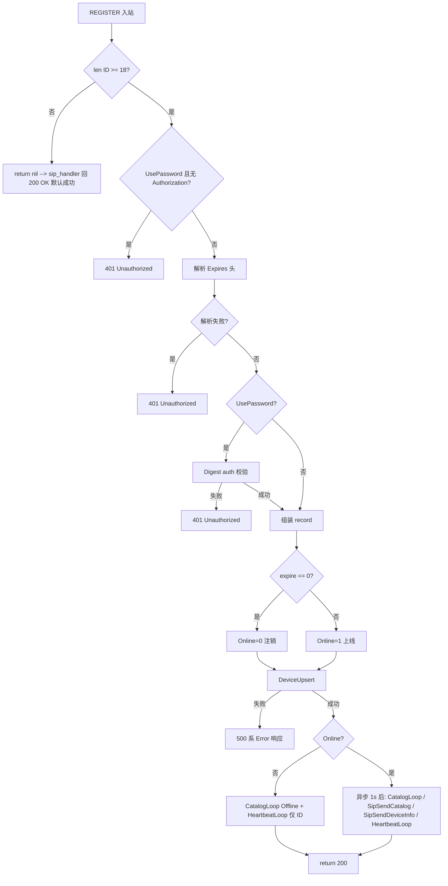

# 国标设备注册

本文将讲解在VSS中 **国标设备REGISTER** 的接入流程：从 gosip 收包、`types.Request` 构建，到 **`RegisterLogic`** 鉴权、**`DeviceUpsert` 落库**，以及 **上线/注销** 后触发的 Catalog、设备信息、心跳等下游任务。实现以VSS仓库源码为准。

**相关文档**：[2.4.1.2 信令发送流水线](./2.4.1.2%20信令发送流水线.md)（注册后 Catalog / `SendLogic`）、[2.4.1.3 设备与通道在线状态](./2.4.1.3%20设备与通道在线状态.md)（在线状态与 `SetDeviceOnline`）。

**项目地址** [https://github.com/openskeye/go-vss](https://github.com/openskeye/go-vss)

---

## 1. 在Vss架构中的位置

|     | 说明                                                                                                        |
|:----|:----------------------------------------------------------------------------------------------------------|
| 传输  | UDP/TCP 等由 gosip 监听；Via 中携带 transport，解析见 **`getTransportProtocol`**。                                     |
| 路由  | **`internal/handler/gbs_sip/routers.go`**：`sip.REGISTER` → **`sip2.DO(..., new(gbssip.RegisterLogic))`**。 |
| 解析  | **`ParseToRequest`**（`internal/pkg/sip/utils.go`）把 **`sip.Request`** 转成 **`types.Request`**。              |
| 业务  | **`RegisterLogic.DO`**（`internal/logic/gbs_sip/register.go`）。                                             |
| 持久化 | RPC **`Device.DeviceUpsert`**（注册与注销统一走 upsert）。                                                           |

注册成功后，后续 **MESSAGE（Catalog、DeviceInfo、Keepalive）**、**SUBSCRIBE**、**INVITE** 等信令，都依赖 **`SipCatalogLoopMap` 中缓存的 `types.Request`**（与注册报文对齐的 From/Via/传输等），见 2.4.1.2。

---

## 2. 请求转为 `types.Request`

**入口**：`sip_handler.run` 在调用具体 Logic 前执行 **`ParseToRequest(h.req)`**；失败则 **400**。

**`ParseToRequest`** 核心字段（节选）：

```core/app/sev/vss/internal/pkg/sip/utils.go:65
func ParseToRequest(req sip.Request) (*types.Request, error) {
	from, ok := req.From()
	if !ok || from.Address == nil {
		return nil, errors.New("OnRegister, no from")
	}

	return &types.Request{
		ID:       from.Address.User().String(),
		Source:   req.Source(),
		Body:     req.Body(),
		Original: req,
		DeviceAddr: sip.Address{
			DisplayName: from.DisplayName,
			Uri:         from.Address,
		},
		Authorization:     req.GetHeaders("Authorization"),
		TransportProtocol: getTransportProtocol(req),
	}, nil
}
```

| 字段                      | 含义                                                                      |
|:------------------------|:------------------------------------------------------------------------|
| **`ID`**                | **From URI 的 user 部分**，作为平台侧 **20 位设备国标编码**（实际长度校验在 Logic 内）。           |
| **`Source`**            | **`req.Source()`**，用于 **`devices.Address`**、**`Name`** 等等价「注册来源/对端地址串」。 |
| **`Original`**          | **完整 SIP 请求**                                                           |
| **`Authorization`**     | 鉴权头，使用`UsePassword` 时参与校验。                                              |
| **`TransportProtocol`** | 由 Via 推断 **UDP/TCP/TLS/WS/WSS**，默认 UDP。                                 |

---

## 3. `RegisterLogic.DO` 流程

### 3.1 流程图



### 3.2 关键步骤

**1）设备 ID 长度**

```core/app/sev/vss/internal/logic/gbs_sip/register.go:38
func (l *RegisterLogic) DO() *types.Response {
	if len(l.req.ID) < 18 {
		return nil
```

- **`<18`**：当前实现 **直接 `return nil`**。在 **`sip_handler.success`** 中 `res == nil` 时仍会回复 **200 OK**。若需拒绝非法 ID，应改为显式 **`BadRequest` / `Unauthorized`**（避免「静默成功」），这里需要自行修改。

**2）密码与鉴权**

- **`Config.Sip.UsePassword == true`** 且 **无 Authorization**：**401**，提示 Authorization 为空。
- 有 Authorization 时：**`auth`** 内 **`Digest`** 与配置 **`Sip.Password`** 比对，**`REGISTER`** 参与 **`CalcResponse`**，失败 **401**。

**3）`Expires`**

- 从 **`Expires`** 头取值：当前代码用 **`strings.Split(header.String(), ":")`** 取第二段再 **`Atoi`**。格式需与库打印的 header 字符串一致，否则解析失败走 **401**（`expire 已过期` 文案实为解析失败分支）。
- **`expire == 0`**：**注销**，**`record.Online = 0`**。

**4）入库字段（默认上线）**

```core/app/sev/vss/internal/logic/gbs_sip/register.go:90
	var (
		now = functions.NewTimer().Now()
		record = &devices.Item{
			Devices: &devices.Devices{
				Name:           l.req.Source,
				AccessProtocol: devices.AccessProtocol_4,
				DeviceUniqueId: l.req.ID,
				State:          1,
				Online:         1,
				Expire:         uint64(now) + uint64(expire),
				Address:        l.req.Source,
				RegisterAt:     uint64(now),
			},
		}
```

- **`AccessProtocol_4`**：固定为 **GB28181**。
- **`Expire`**：当前 Unix 秒 + 注册生存期（秒）。
- **注册不经过 `SetDeviceOnline`**：在线状态由 **`DeviceUpsert`** 一并写入；与心跳里的 **`SetDeviceOnline` 队列**（见 2.4.1.3）是不同路径。

**5）`200 OK` 与附加 SIP 头（`BeforeResponse`）**

- 若存在 **`Authorization`** 且匹配成功，在响应中附加 **`Expires` / `User-Agent` / `Server`**，并 **`RemoveHeader("Allow")`**（与设备交互兼容相关，以现网设备为准）。
- 未带 Authorization时，`BeforeResponse` 里 **`ok == false`** 可能不追加上述头，依赖设备是否要求 Expires。

**6）注销（`expire == 0`）**

- **`SipCatalogLoop`**：`Online: false`，**`CatalogLoopLogic`** 从 **`SipCatalogLoopMap`** 移除该设备。
- **`SipHeartbeatLoop`**：仅 **`ID`**，用于更新/清理心跳 map 中条目（与上线时携带 **`Now` / `RegisterExpireAt`** 的完整结构不同）。

**7）上线成功后的异步任务（`Sleep 1s`）**

```core/app/sev/vss/internal/logic/gbs_sip/register.go:178
go func() {
    time.Sleep(1 * time.Second)
    l.svcCtx.SipCatalogLoop <- &types.SipCatalogLoopReq{ Req: l.req, Online: true, Now: now }
    l.req.Caller = functions.CallerFile(1)
    l.svcCtx.SipSendCatalog <- l.req
    l.svcCtx.SipSendDeviceInfo <- l.req
    l.svcCtx.SipHeartbeatLoop <- &types.SipHeartbeatLoopReq{
        ID:               record.DeviceUniqueId,
        Now:              now,
        RegisterExpireAt: now + int64(expire),
    }
}()
```

| action                       | 作用                                                                                                              |
|:-----------------------------|:----------------------------------------------------------------------------------------------------------------|
| **`SipCatalogLoop` + `Now`** | 注册定时 Catalog（判据见 `catalog_loop.go`，信令发送流水线中已经说明可能与预期不一致）。                                                       |
| **`SipSendCatalog`**         | **立即拉目录**（经 **`SendLogic`** → **`GBSSender.Catalog`**）。                                                         |
| **`SipSendDeviceInfo`**      | **立即拉设备信息**。                                                                                                    |
| **`SipHeartbeatLoop`**       | **`HeartbeatOfflineLogic`** 每秒扫描；**`RegisterExpireAt`** 为 **本次注册到期 Unix 秒**，与 **`HeartbeatTimeout`** 等配合判定异常下线。 |

**延迟 1 秒**：降低被对端或中间网络丢弃的概率，这里属于折中方案，可以优化。

---

## 4. 调试与排障建议

| 现象         | 可查点                                                                     |
|:-----------|:------------------------------------------------------------------------|
| 注册成功但无目录   | **`SipSendCatalog`** 是否积压、`SendLogic` 日志、`SipCatalogLoopMap` 是否在注销时被清掉。 |
| 一直 401     | **`UsePassword`、Authorization 格式、密码与设备配置、`Expires` 解析是否失败**。            |
| ID 过短仍「成功」 | **`len(l.req.ID) < 18` 返回 nil** 导致 **200**；这里可以明确错误码，目前我返回的为200 ok。     |
| 出站信令报设备未注册 | 业务接口常查 **`SipCatalogLoopMap`**；设备须先完成注册流水线把 **`Request` 放进 map**。       |

---

## 5. 源码索引

| 文件                                                                   | 说明                                                      |
|:---------------------------------------------------------------------|:--------------------------------------------------------|
| `core/app/sev/vss/internal/handler/gbs_sip/routers.go`               | REGISTER 路由                                             |
| `core/app/sev/vss/internal/logic/gbs_sip/register.go`                | **`RegisterLogic`**                                     |
| `core/app/sev/vss/internal/pkg/sip/utils.go`                         | **`ParseToRequest`、传输协议**                               |
| `core/app/sev/vss/internal/pkg/sip/sip_handler.go`                   | 统一 **`DO`/响应码**                                         |
| `core/app/sev/vss/internal/types/types.go`                           | **`Request`、`SipCatalogLoopReq`、`SipHeartbeatLoopReq`** |
| `core/app/sev/vss/internal/logic/gbs_proc/catalog_loop.go`           | Catalog 定时器                                             |
| `core/app/sev/vss/internal/logic/gbs_proc/heartbeat_offline_loop.go` | 注册到期与心跳超时下线                                             |
