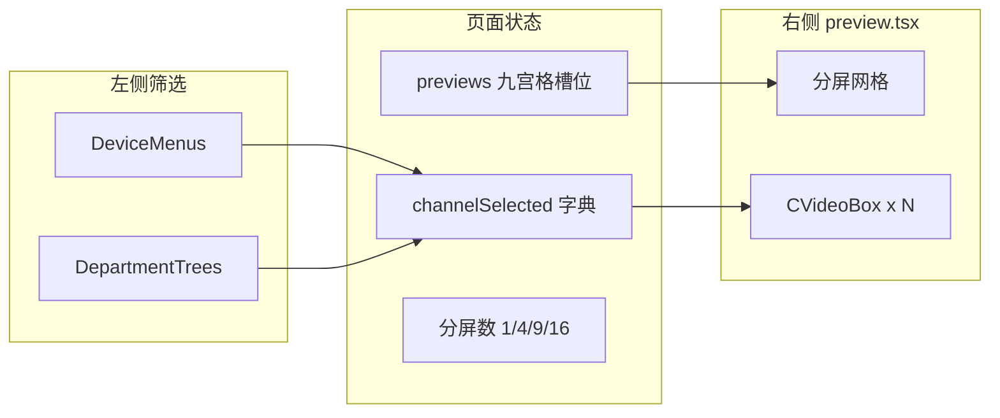

# 视频调阅与电子地图 `src/pages/video-filters`

本文档将描述 **视频调阅** 与 **电子地图** 在前端的实现思路、模块边界以及与后端的协作方式。实现集中在 `src/pages/video-filters` 目录，通过 **`pageType`** 在同一套壳里切换右侧主区域：分屏预览或地图。

**项目地址** [https://github.com/openskeye/skeyevss_frontend_web](https://github.com/openskeye/skeyevss_frontend_web)

---

## 1. 为什么共用一个大页面？

`index.tsx` 中 `Main` 组件接收：

```ts
pageType: 'maps' | 'video-preview'
```

- **左侧**始终是「筛选区」：`Tabs` 切换 **设备列表**（`DeviceMenus`）与 **组织架构**（`DepartmentTrees`），权限由 `Setting` 中的 `permissionIds` / `super` 控制（如 `P_1_4_1`、`P_1_4_2`）。
- **右侧**按 `pageType` 二选一：
  - `video-preview` → `components/preview.tsx`（多分屏网格）
  - `maps` → `components/maps.tsx`（Leaflet 地图 + 标记弹窗内嵌播放器）

这样设备树、通道选择、与通道列表相关的状态（`channelSelected`、`previews` 等）可以复用；地图模式额外把 `DeviceMenus` 的「点位设置」「点击定位」接到 `MapRef`。

---

## 2. 视频调阅：数据流与交互

### 2.1 整体结构



- 用户在树或列表中点选通道 → `onSelectChannel` 更新 `channelSelected`，并在当前 `selectedIndex` 对应的格子里写入该通道 `uniqueId`（若该通道已在其他格则**腾挪/去重**），然后焦点切到下一格（轮询布局）。
- `previews: string[]` 长度等于 `splitStyle`（`model.ts` 里 `SplitStyle` 枚举），每个元素是通道 `uniqueId` 或空串 `''`。
- 视频调阅

- 电子地图


### 2.2 播放器与取流（核心）

每个有信号的格子渲染 `#components/video` 的 `CVideoBox`，传入 `deviceUniqueId`、`channelUniqueId`。组件内部调用 `GetVideoStream`（`#repositories/apis/base` → `/internal/vss/video/stream`），由后端生成/拉取媒体流并返回 **多协议播放地址**（如 HTTP-FLV、WebRTC 等）。

要点（见 `src/components/video/index.tsx`）：

- 成功后把 `VideoStreamResp` 存本地 state，并通过 **`videoStream` 回调** 向上抛出，父组件用 `setVideoStreamRefCall(uniqueId, v)` 缓存，供「当前选中格」的云台控制等使用。
- **直播**：默认按系统设置里的 `mediaServerVideoPlayAddressType` 选一条地址；**回放**：`startAt` / `endAt` 非零时偏向 HTTP-FLV，并会走 `StopVideoStream`、`PlaybackControl` 等配套接口。
- 组件卸载时在 `useEffect` cleanup 里 `stopVideoStream()`，避免僵尸流。

### 2.3 分屏、轮播、预设

| 能力          | 实现要点                                                                                                                                            |
|-------------|-------------------------------------------------------------------------------------------------------------------------------------------------|
| 1/4/9/16 分屏 | `SplitStyle` + `onSetSplitStyle`；切换时若当前选中格超出范围则回到 0                                                                                             |
| 全屏          | `screenfull` 包住整个 `#videos` 容器                                                                                                                  |
| 轮播          | `handleSlideVideos` 打开 `ChannelsPopup`，`setInterval` 按页把 `previews` 更新为通道 id 的滑动窗口；当 `splitStyle >= 通道数` 时自动停轮播                                 |
| 本地预设        | `VideoPreviewPreinstall`（`#repositories/cache/ls`）存 `title + splitStyle + selectedIndex + previews`；应用时用 `ChannelListApi` 按 `uniqueId` 批量拉回通道实体 |

### 2.4 组织架构侧栏

- `fetchChannels` 拉全量通道并按 `depIds` 聚合成 `channelGroups`；右键部门可「设置分组」批量改 `depIds`，与 **通道管理 API**（`ChannelUpdate`）一致。
- 通道节点点击行为与设备树一致，最终都走 `onSelectChannel`。

---

## 3. 电子地图：瓦片、标记与弹窗内播放

### 3.1 技术选型

- **react-leaflet**：`MapContainer`、`TileLayer`、`Marker`、`Popup`。
- **辅助组件**（`#components/sundry`）：`DirectTianDiTuLayer`（在线天地图）、`MapClickHandler`、`MapPointController`（程序化移动中心/缩放）、`MapSizeUpdater`（左侧折叠时触发表单重算尺寸）。

### 3.2 标记从哪来？

`loadChannels` 调用 `ChannelListApi`，**条件为纬度、经度均大于 0**：

```156:170:src/pages/video-filters/components/maps.tsx
const loadChannels = (): void => {
    void ChannelListApi({
        all: true,
        conditions: [
            {
                column: 'latitude',
                value: 0,
                operator: Operator.gt
            },
            {
                column: 'longitude',
                value: 0,
                operator: Operator.gt
            }
        ]
    }).then(
    ...
```

返回的 `list` 与 `maps`（设备字典）拼成 `MapMarker`：`position: [latitude, longitude]`，使用 **Leaflet 约定 `[lat, lng]`**。另外有一个固定的 **中心点** `defCenterPoint`（可来自系统设置 `mapCenterPoints` 或常量默认值）。

### 3.3 底图策略

根据 Recoil 里的 `Setting`：

- 若配置了本地瓦片路径 `mapTiles`：走 **`TileLayer`**，`url` 为 `{proxy-file-url}/{mapTiles}/{z}/{x}/{y}.png`（离线包）。
- 否则若配置了 `tmap-key`：走 **`DirectTianDiTuLayer`**（在线天地图矢量 + 注记）。
- 初始 `center` / `zoom` 来自 `mapCenterPoints`、`mapZoom`。

### 3.4 弹窗里的视频与云台

每个通道 `Marker` 的 `Popup` 内渲染 `MapDevicePopup`：

- 内嵌 **同一套 `CVideoBox`**，同样走 `GetVideoStream`。
- `videoStream` 回调里：`setVideoStreamRefCall(channelUniqueId, v)` + `setSelectedVideo(v)`，供全局「当前流」展示码率等。
- 若设备支持控制（`controlState()`），在弹窗顶部渲染 `ControlWidget`（云台拖拽等，与视频调阅里控制条一致）。

`CMarker` 在 `click` 时调用 `tracingMenu(channelItem, false)`，在 `popupclose` 时 `tracingMenu(..., true)`，用于与左侧设备树 **展开/高亮联动**。

### 3.5 父组件驱动的地图 API

`MapRef`（`useImperativeHandle`）对外暴露：

- **`reloadMap({ channelItem })`**：以该通道坐标为新中心、`zoom: 10`，清空非中心标记后重新 `loadChannels`（例如在设备树里编辑完坐标后刷新）。
- **`location({ channelItem })`**：`MapPointController` 飞到该点，并对匹配坐标的 marker **`openPopup()`**。

设备树侧通过 `reloadMap` / `location` 与 `channelClick`（地图模式点通道名则定位）与地图联动；地图模式下还可把 `SetChannelPoints` 作为 `DeviceMenus` 的 `pointComponent`，在树上维护经纬度（需许可且非许可证错误状态）。

---

## 4. 注意点

1. **性能**：多分屏下多个 `CVideoBox` 会并发拉流，需注意浏览器解码与媒体服务路数；轮播会频繁切换格子，依赖组件卸载时 `stopVideoStream`。
2. **HTTPS**：`GetVideoStream` 会传 `https: window.location.protocol === 'https:'`，与 WebRTC/WSS 链路一致。
4. **坐标系**：若后端存 GCJ-02/WGS84，需与天地图/离线瓦片一致，否则会出现偏移；此仓库前端按「直接使用通道经纬度」假定已与底图匹配。

---

## 5. 关键文件索引

| 路径                                                      | 作用                        |
|---------------------------------------------------------|---------------------------|
| `src/pages/video-filters/index.tsx`                     | page入口：筛选 + `pageType` 分支 |
| `src/pages/video-filters/components/preview.tsx`        | 分屏 UI、预设、全屏、轮播入口          |
| `src/pages/video-filters/components/maps.tsx`           | Leaflet、标记、取带坐标通道、MapRef  |
| `src/pages/video-filters/components/control-widget.tsx` | 弹窗内云台控制                   |
| `src/pages/video-filters/model.ts`                      | 分屏枚举                      |
| `src/components/video/index.tsx`                        | 统一取流与播放器切换                |
| `src/repositories/apis/base.ts`                         | `GetVideoStream` 等接口      |


