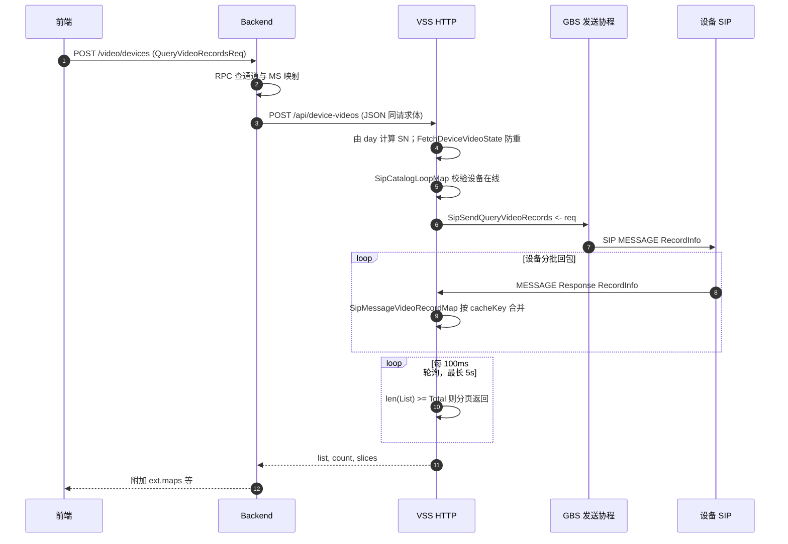

# GB28181 设备录像查询

## 简介

在 **GB/T 28181** 场景下，平台通过 VSS（信令侧）向设备下发 **RecordInfo** 查询，设备以 **MESSAGE** 分批次回传录像片段；服务端在内存中按 **SN** 聚合，直到 `SumNum` 与已收条数一致或超时。本文说明 **Web 前端如何调用**、**Backend → VSS 的后端链路**，并保留协议与抓包示例。

---

## 一、前端实现

### 1.1 设备录像页（GB28181 列表 / 时间轴）

| 项目 | 说明 |
|------|------|
| **代码路径** | `src/pages/videos/devices/`（`index.tsx`、`api.ts`、`model.tsx`） |
| **HTTP** | `POST {backend}/video/devices` |
| **权限** | 表格使用 `P_1_5_1`（见 `index.tsx`） |

**典型流程：**

1. 路由 `anchor` 解析出 `deviceUniqueId`、`channelUniqueId` 等（与 `../common` 中 `anchorParse` 一致）。
2. 表格拉列表时调用 `List`（`api.ts`），请求体为 `QueryVideoRecordsReq` 同类字段：`deviceUniqueId`、`channelUniqueId`、`day`（当日零点时间戳 ms）、`page`、`limit` 等。
3. 响应里除 `list`、`count` 外，后端会带 **`ext.maps`**：按通道返回 MS 地址等信息；前端用其拼回放 URL，并结合 `AllGroups`、`FetchDeviceRecordFiles` 做下载进度与文件路径展示（见 `index.tsx`）。
4. **时间轴**：`handleListResponse` 里用 **`res.data.slices`** 做 `mergeTimeIntervals` 后交给 `CTimeline`；**`res.data.ext.maps`** 为通道对应的 MS 地址等；**`ext.times`** 在该页主要用于兼容字段（可与 sk 页区分）。

### 1.2 录像计划配置（与设备录像的关联）

| 项目 | 说明 |
|------|------|
| **代码路径** | `src/pages/configs/video-projects/`（录像工程 / 计划 CRUD） |
| **路由** | 一般为 `/video-project` 相关配置页 |
| **关系** | 配置「哪些通道、什么计划」；**设备录像列表**页上的 **「录像计划」** 会 **跳转** 到该模块，便于从业务入口维护计划。**拉取设备侧录像索引仍走 `/video/devices`**，不是本模块的 API。 |

### 1.3 易混路径小结

| 页面路径 | 接口 | 数据来源 |
|----------|------|----------|
| `videos/devices` | `POST /video/devices` | VSS → GB28181 RecordInfo |
| `videos/sk` | `POST /video/sk` | MS `query_daily`（平台录像） |
| `configs/video-projects` | 业务 CRUD（如 `/video-project`） | 配置数据，非设备 SIP 查询 |

---

## 二、后端实现流程

### 2.1 整体链路



### 2.2 Backend（`core/app/sev/backend`）

| 文件                                               | 职责                                                                                                                           |
|--------------------------------------------------|------------------------------------------------------------------------------------------------------------------------------|
| `internal/handler/videos/devices/listhandler.go` | `POST /video/devices`，权限 `P_0_4_1_3`                                                                                         |
| `internal/logic/videos/devices/listlogic.go`     | 解析 `QueryVideoRecordsReq`；RPC 取通道与 MS；`HttpPostJson` 调 **`{VssHttpUrlInternal}/api/device-videos`**；把 MS 信息写入 **`ext.maps`** |

### 2.3 VSS HTTP（`core/app/sev/vss`）

| 文件                                          | 职责                                                                                                                                                                                                                                                                                                                                   |
|---------------------------------------------|--------------------------------------------------------------------------------------------------------------------------------------------------------------------------------------------------------------------------------------------------------------------------------------------------------------------------------------|
| `internal/handler/http/routers.go`          | 注册 `POST /device-videos`（挂载在 **`/api`** 组下 → **`/api/device-videos`**）                                                                                                                                                                                                                                                               |
| `internal/logic/http/base/device_videos.go` | **VideosLogic**：从 `req.Day` 格式化后解析出 **SN**；**cacheKey** = `sip.VideoRecordMapKey(device, channel, SN)`；**FetchDeviceVideoState** 避免同日同设备重复发 SIP；向 **`SipSendQueryVideoRecords`** 投递请求；**100ms ticker** 读 **`SipMessageVideoRecordMap`**，当 **`len(List) >= Total`** 时分页并返回 `list`、`count`、`slices`；**5s 超时** 返回「设备视频获取超时」；结束后延迟清理 map |

### 2.4 SIP 发送与回包聚合

| 文件                                         | 职责                                                                                     |
|--------------------------------------------|----------------------------------------------------------------------------------------|
| `internal/logic/gbs_proc/send_sip_proc.go` | 消费 `SipSendQueryVideoRecords`，调用 `GBSSender.QueryVideoRecords`                         |
| `internal/pkg/sip/gbs_send.go`             | 组装 **RecordInfo** XML，`StartTime`/`EndTime` 为查询日、`Type=all`，**MESSAGE** 下发             |
| `internal/pkg/sip/utils.go`                | `VideoRecordMapKey(deviceUniqueId, channelUniqueId, sn)` → MD5 字符串                     |
| `internal/logic/gbs_sip/video_records.go`  | 解析设备 **Response**，按 **cacheKey** 合并 **`SipMessageVideoRecordMap`**（含 GBC 转发分支，部分 TODO） |

### 2.5 请求体要点（`QueryVideoRecordsReq`）

- `deviceUniqueId`、`channelUniqueId`：业务侧唯一 ID。  
- `day`：查询日（毫秒时间戳，服务端用于算 **SN** 与当日起止）。  
- `page`、`limit`：在 **聚合完成后的全量 List** 上做分页。  
- `SN`：一般由服务端从 `day` 推导，客户端可不传。

---

## 三、协议与抓包示例

设备录像查询依赖 **分批次异步响应**：`SumNum` 为总条数，多次 MESSAGE 的 `RecordList` 累加直至等于 `SumNum`（与 VSS 中 `len(List) >= Total` 的判断一致）。

### 3.1 平台下发 RecordInfo（Query）

```
[GBS] 2026-03-02 17:15:21 [UDP][192.168.50.87:11008]>>>>>>[192.168.50.104:5060]>>>>>>
MESSAGE sip:34020000001320000105@192.168.50.104:5060 SIP/2.0
Via: SIP/2.0/UDP 192.168.50.87:11008;rport=11008;branch=z9hG4bK2712176421
From: <sip:31010000042220000002@192.168.50.87:11008>;tag=020468337
To: <sip:34020000001320000105@192.168.50.104:5060>
Call-ID: 5767747845
User-Agent: SkeyevssSevVss 192.168.50.87
CSeq: 33 MESSAGE
Max-Forwards: 70
Content-Type: Application/MANSCDP+xml
Content-Length: 251

<?xml version="1.0" encoding="GB2312"?>
<Query>
  <CmdType>RecordInfo</CmdType>
  <SN>32</SN>
  <DeviceID>34020000001320000105</DeviceID>
  <StartTime>2026-03-02T00:00:00</StartTime>
  <EndTime>2026-03-02T23:59:59</EndTime>
  <Type>all</Type>
</Query>
```

### 3.2 设备回包（Response，分批）

```
[GBS] 2026-03-02 17:15:22 [UDP][[::]:11008]<<<<<<[192.168.50.104:5060]<<<<<<
MESSAGE sip:31010000042220000002@3101000004 SIP/2.0
Via: SIP/2.0/UDP 192.168.50.104:5060;rport=5060;branch=z9hG4bK649193898
From: <sip:34020000001320000104@3101000004>;tag=1724001754
To: <sip:31010000042220000002@3101000004>
Call-ID: 1344951889
CSeq: 20 MESSAGE
Content-Type: Application/MANSCDP+xml
Max-Forwards: 70
User-Agent: IP Camera
Content-Length: 808

<?xml version="1.0" encoding="GB2312"?>
<Response>
    <CmdType>RecordInfo</CmdType>
    <SN>32</SN>
    <DeviceID>34020000001320000105</DeviceID>
    <Name>Camera 01</Name>
    <SumNum>19</SumNum>
    <RecordList Num="2">
        <Item>
            <DeviceID>34020000001320000105</DeviceID>
            <Name>Camera 01</Name>
            <FilePath>file_path</FilePath>
            <Address>Address 1</Address>
            <StartTime>2026-03-01T23:59:59</StartTime>
            <EndTime>2026-03-02T00:09:11</EndTime>
            <Secrecy>0</Secrecy>
            <Type>time</Type>
            <FileSize>66766336</FileSize>
        </Item>
        <Item>
            <DeviceID>34020000001320000105</DeviceID>
            <Name>Camera 01</Name>
            <FilePath>file_path</FilePath>
            <Address>Address 1</Address>
            <StartTime>2026-03-02T00:09:11</StartTime>
            <EndTime>2026-03-02T00:45:39</EndTime>
            <Secrecy>0</Secrecy>
            <Type>time</Type>
            <FileSize>264585728</FileSize>
        </Item>
    </RecordList>
</Response>
```

---

## 四、排障提示

- **超时「设备视频获取超时」**：5s 内未满足 `len(List) >= Total`，或设备不回 / 回包慢；可查 SIP MESSAGE 是否到达、SN 是否一致。  
- **设备未注册**：`SipCatalogLoopMap` 无该 `deviceUniqueId` 会直接报错（常量 `DeviceUnregistered`）。  
- **重复打开同一天**：`FetchDeviceVideoState` 命中时会只轮询缓存，不再重复下发 SIP。  

---

## 五、相关代码索引（本仓库）

| 模块 | 路径 |
|------|------|
| VSS 设备录像 HTTP | `core/app/sev/vss/internal/logic/http/base/device_videos.go` |
| VSS RecordInfo 回包 | `core/app/sev/vss/internal/logic/gbs_sip/video_records.go` |
| SIP 下发 RecordInfo | `core/app/sev/vss/internal/pkg/sip/gbs_send.go` |
| Backend 转发 VSS | `core/app/sev/backend/internal/logic/videos/devices/listlogic.go` |

前端仓库（用户本机路径示例）：

- 设备录像 UI：`src/pages/videos/devices`
- 录像计划配置：`src/pages/configs/video-projects`
