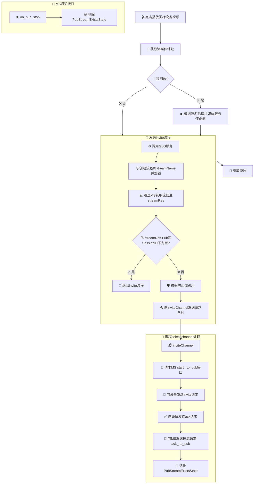

<!--
    国标设备live stream_play播放接口

server
	MS: 媒体服务
	VSSHttp: vss http服务
	GBC: 国标级联(下级)
	GBS: 国标信令服务器

A. 点击播放国标设备视频
	1. 获取流媒体地址

	2. 如果是回放
		根据流名称请求媒体服务 停止流
	
	3. 发送invite
		调用GBS服务
			a). 创建流名称(streamName)
				根据streamName加锁
				每个streamName在自己的invite流程未执行完都不能调用
			b). 通过MS获取流信息(streamRes)
				流信息结果中如果 streamRes.Pub, streamRes.SessionID 不为空就退出invite流程
			c). 校验防止流占用
				在完成invite流程后记录记录流名称(PubStreamExistsState)
				如果streamName在PubStreamExistsState存在并且(streamRes.Pub为空或者streamRes.SessionID为空)
					发送 停止流请求
			d). 向inviteChannel管道中发送invite请求队列(inviteChannel)

	4. 获取快照(携程)

B. 携程select channel
	inviteChannel
		1. 请求MS api start_rtp_pub接口(开始国标收流/接收国标推流)

		2. 向设备发送invite请求
	
		3. 向设备发送ack请求
	
		4. 向MS发送拉流请求 ack_rtp_pub
	
		5. 记录PubStreamExistsState

C. MS 通知接口
	on_pub_stop
		删除PubStreamExistsState
-->